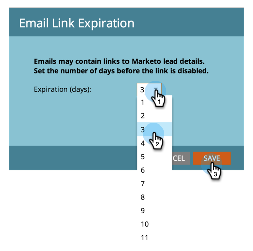

# Cambiar el tiempo de caducidad de las direcciones URL en los mensajes de correo electrónico del informe {#change-the-expiration-time-for-urls-in-report-emails}

>[!NOTE]
>
>**Se requieren permisos de administración**

Los vínculos de los mensajes de correo electrónico de suscripción de informes caducan pasados tres días. Para cambiar la caducidad de estos vínculos, siga estos pasos.

1. En **Administración**, haga clic en **Configuración de inicio de sesión**.

   

1. Haga clic en el botón **Editar caducidad de URL**.

   

1. Seleccione en el menú desplegable cuántos días antes de que caduque el vínculo. Haga clic en **Guardar**.

   

   Genial, ha editado la configuración de caducidad del vínculo de correo electrónico.

   >[!NOTE]
   >
   >Recuerde que solo se aplican a los vínculos de los informes y las alertas, no a los correos electrónicos de marketing.
