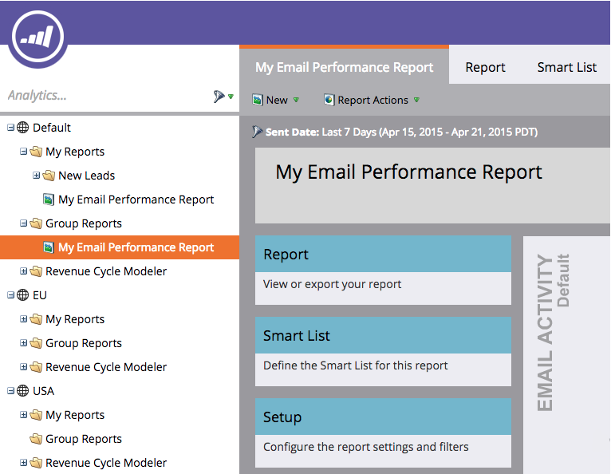

# Clonar un informe en informes de grupo {#clone-a-report-to-group-reports}

Cualquier informe de **[!UICONTROL Mis informes]** solo es visible para usted. ¿Qué sucede si desea que el informe sea accesible para todos los demás? A continuación se indica cómo hacerlo:

1. En el área **[!UICONTROL Analytics]**, haga clic en el [informe guardado](/help/marketo/product-docs/reporting/basic-reporting/creating-reports/save-a-report.md) que desee.

   

   >[!NOTE]
   >
   >Alternativamente, un informe guardado se puede clonar en **[!UICONTROL Informes de grupo]** arrastrando el informe a la carpeta.

1. Haga clic en **[!UICONTROL Acciones de informe]** y seleccione **[!UICONTROL Clonar informe]**.

   

1. Haga clic en el menú desplegable **[!UICONTROL Clonar a]** y seleccione su grupo. Seleccione la **[!UICONTROL carpeta]**.

   

1. **[!UICONTROL Nombre]** el informe y haga clic en **[!UICONTROL Clonar]**.

   

   ¡Genial! Su informe ahora aparecerá en **[!UICONTROL Informes de grupo]**.

   
