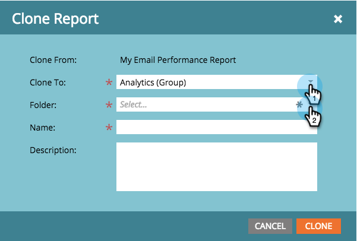

# Clonar un informe para agrupar informes {#clone-a-report-to-group-reports}

Cualquier informe de **Mis informes **solo es visible para usted. ¿Qué sucede si desea que el informe sea accesible para todos los demás? Así es como se puede hacer eso:

1. En el área **Analytics**, haga clic en el [informe guardado](/help/marketo/product-docs/reporting/basic-reporting/creating-reports/save-a-report.md) que desee.

   

   >[!NOTE]
   >
   >Como alternativa, un informe guardado se puede clonar en **Informes de grupo** arrastrando el informe a la carpeta.

1. Haga clic en **Acciones de informe** y seleccione **Clonar informe**.

   

1. Haga clic en la lista desplegable **Clonar a** y seleccione el grupo. Seleccione la **Carpeta**.

   

1. **Asigne un** nombre al informe y haga clic en  **Clonar**.

   

   ¡Genial! El informe ahora aparecerá en **Informes de grupo**.

   
