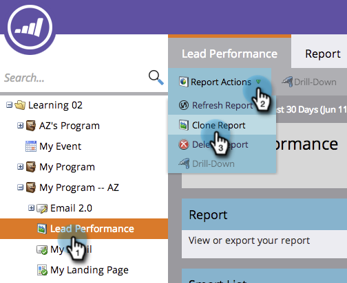
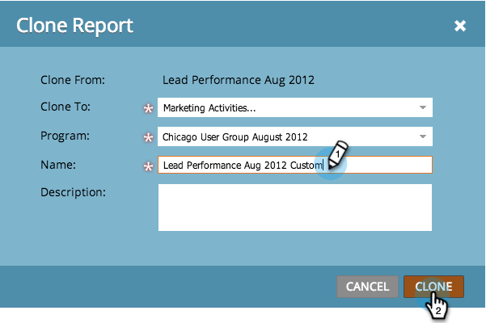

# Clonar un informe {#clone-a-report}

Cree un duplicado del informe para personalizarlo aún más sin cambiar el original.

1. Vaya al área **Actividades de marketing** (o **Análisis**).

   

1. Seleccione el informe. Seleccione **Acciones de informe > Clonar un informe**.

   

   >[!TIP]
   >
   >También puede clonar un informe haciendo clic con el botón secundario en él en el árbol.

1. Asigne un nombre al clon del informe.

   

   Eso es todo - usted está listo para el inicio de personalizar su clon!

   >[!MORELIKETHIS]
   >
   >
   >    
   >    
   >    * [Filtrar personas en un informe con una Lista inteligente](../../../../product-docs/reporting/basic-reporting/editing-reports/filter-people-in-a-report-with-a-smart-list.md)

   Haga mucho más para personalizar el informe. Consulte [Sistema de informes básico](https://docs.marketo.com/display/docs/basic+reporting).

