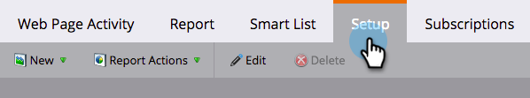

# Mostrar personas o visitantes anónimos en los informes web {#display-people-or-anonymous-visitors-in-web-reports}

>[!PREREQUISITES]
>
>[Agregar código de seguimiento de Munchkin a su sitio web](/help/marketo/product-docs/administration/additional-integrations/add-munchkin-tracking-code-to-your-website.md)

En los informes [[!UICONTROL Actividad de la página web]](/help/marketo/product-docs/reporting/basic-reporting/report-types/web-page-activity-report.md) y [[!UICONTROL Actividad web de la compañía]](/help/marketo/product-docs/reporting/basic-reporting/report-types/company-web-activity-report.md) puede ver [personas o visitantes anónimos](/help/marketo/product-docs/core-marketo-concepts/smart-lists-and-static-lists/managing-people-in-smart-lists/understanding-anonymous-activity-and-people.md) que visitan el sitio. Los visitantes anónimos han deducido datos, como el área metropolitana.  A continuación, se indica cómo seleccionar si el informe muestra los posibles clientes conocidos o los visitantes anónimos.

1. En su informe de [!UICONTROL Actividad de la página web], haga clic en **[!UICONTROL Configurar]**.

   

1. Haga doble clic en **[!UICONTROL Activity Source]**.

   

1. En la ventana emergente, seleccione **[!UICONTROL Posibles clientes conocidos]** (personas) o **Visitantes anónimos** de la lista desplegable.

   

   >[!NOTE]
   >
   >La inclusión de ISP para visitantes anónimos genera un informe más largo, pero su exclusión proporciona una visión más clara de la procedencia de los visitantes, además de las fuentes estándar, como Google.

1. Haz clic en la pestaña **[!UICONTROL Informe]** para volver y ver el informe con personas conocidas o anónimas.

   

>[!MORELIKETHIS]
>
>[Seguimiento de personas y actividades anónimas](/help/marketo/product-docs/reporting/basic-reporting/report-activity/tracking-anonymous-activity-and-people.md)
