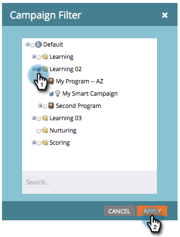

# Filtrar un informe de actividad de campaña {#filter-a-campaign-activity-report}

Enfoque su [informe de actividad de campaña](/help/marketo/product-docs/reporting/basic-reporting/report-types/campaign-activity-report.md) en [campañas inteligentes](/help/marketo/product-docs/core-marketo-concepts/smart-campaigns/creating-a-smart-campaign/understanding-batch-and-trigger-smart-campaigns.md) específicas.

>[!NOTE]
>
>El filtrado de recursos en los informes no se admite en el modo satélite (el icono &quot;abrir en una nueva ventana&quot; a la derecha de la página de detalles del recurso).

1. Vaya a **Actividades de marketing** (o a **Analytics**) y seleccione su informe de actividad de campaña.

   

1. Haga clic en la ficha **[!UICONTROL Configuración]** y haga doble clic en **[!UICONTROL Campañas]**.

   

1. Elija las carpetas y las campañas inteligentes específicas que desea incluir en el informe. Haga clic en **[!UICONTROL Aplicar]**.

   

   >[!TIP]
   >
   >Si selecciona una carpeta, el informe incluirá todo lo que la carpeta contenga en el momento en que se ejecute el informe.

1. ¡Ya terminaste! Haz clic en la pestaña **[!UICONTROL Informe]** para ver _solo_ las campañas inteligentes seleccionadas en tu informe.

   

>[!MORELIKETHIS]
>
>[Informe de rendimiento del correo electrónico de Campaign](/help/marketo/product-docs/reporting/basic-reporting/report-types/campaign-email-performance-report.md)
