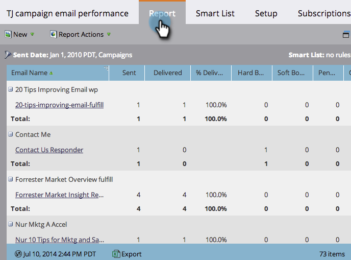

# Filtrar recursos en informes de correo electrónico de Campaña {#filter-assets-in-a-campaign-email-reports}

Centre el informe [Rendimiento del correo electrónico de la Campaña](../../../../product-docs/reporting/basic-reporting/report-types/campaign-email-performance-report.md) en campañas [inteligentes](https://docs.marketo.com/display/docs/smart+campaigns) específicas de sus programas (&#39;activos locales&#39;) o en las que se han archivado.

1. Vaya al área **Analytics **(o **Actividades de marketing**).

   

1. Seleccione el informe de rendimiento del correo electrónico.

   

1. Haga clic en la ficha **Configuración** y arrastre sobre un filtro.

   

   * **Campañas**: Campañas inteligentes activas en la cuenta de Marketing.
   * **Campañas** archivadas: Campañas inteligentes inactivas y retiradas.

1. Elija las carpetas y campañas inteligentes específicas que desee incluir en el informe.

   

   >[!TIP]
   >
   >Si selecciona una carpeta, el informe incluirá todo lo que contenga en el momento en que se ejecute el informe.

1. ¡Ya has terminado! Haga clic en la ficha **Informe** para ver el informe filtrado.

   

   >[!MORELIKETHIS]
   >
   >
   >    
   >    
   >    * [Informe de rendimiento de correo electrónico de campaña](../../../../product-docs/reporting/basic-reporting/report-types/campaign-email-performance-report.md)
   >    * [Filtrar recursos en un informe de correo electrónico](filter-assets-in-an-email-report.md)

   >[!NOTE]
   >
   >**Buceo profundo**
   >
   >
   >Obtenga información sobre los informes en [Sistema de informes básico](https://docs.marketo.com/display/docs/basic+reporting).

