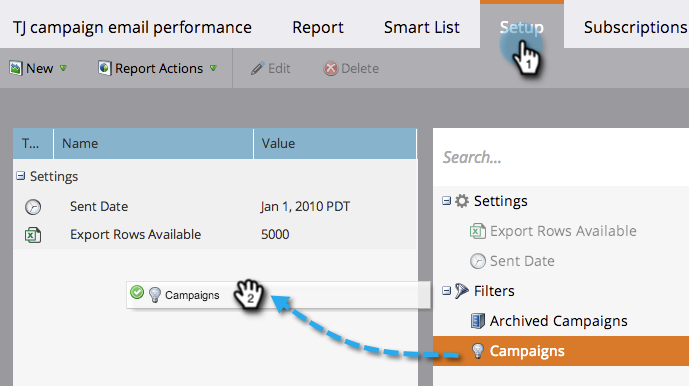

# Filtrar recursos en informes por correo electrónico de campaña {#filter-assets-in-a-campaign-email-reports}

Enfoque su informe de [Rendimiento de correo electrónico de Campaign](/help/marketo/product-docs/reporting/basic-reporting/report-types/campaign-email-performance-report.md) en [campañas inteligentes](/help/marketo/product-docs/core-marketo-concepts/smart-campaigns/creating-a-smart-campaign/understanding-batch-and-trigger-smart-campaigns.md) específicas de sus programas (&quot;recursos locales&quot;) o en los que se han archivado.

>[!NOTE]
>
>El filtrado de recursos en los informes no se admite en el modo satélite (el icono &quot;abrir en una nueva ventana&quot; a la derecha de la página de detalles del recurso).

1. Vaya al área de **Analytics** (o **Actividades de marketing**).

   

1. Seleccione el informe de rendimiento del correo electrónico.

   

1. Haga clic en la ficha **[!UICONTROL Configuración]** y arrastre el cursor sobre un filtro.

   

   * **[!UICONTROL Campañas]**: Campañas inteligentes activas en tu cuenta de Marketo.
   * **[!UICONTROL Campañas archivadas]**: Campañas inteligentes inactivas y retiradas.

1. Elija las carpetas y las campañas inteligentes específicas que desea incluir en el informe.

   

   >[!TIP]
   >
   >Si selecciona una carpeta, el informe incluirá todo lo que la carpeta contenga en el momento en que se ejecute el informe.

1. ¡Ya terminaste! Haga clic en la ficha **[!UICONTROL Informe]** para ver el informe filtrado.

   

   >[!MORELIKETHIS]
   >
   >[Informe de rendimiento de correo electrónico de campaña](/help/marketo/product-docs/reporting/basic-reporting/report-types/campaign-email-performance-report.md)
   >[Filtrar Assets en un informe de correo electrónico](/help/marketo/product-docs/reporting/basic-reporting/report-activity/filter-assets-in-an-email-report.md)
