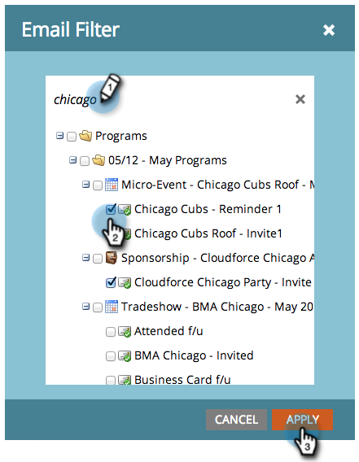

# Filtrar recursos en un informe por correo electrónico {#filter-assets-in-an-email-report}

Centra tu informe de [Rendimiento del correo electrónico](/help/marketo/product-docs/email-marketing/email-programs/email-program-data/email-performance-report.md) o [Rendimiento de los vínculos de correo electrónico](/help/marketo/product-docs/email-marketing/email-programs/email-program-data/email-link-performance-report.md) en los correos electrónicos de tus programas (&quot;recursos locales&quot;), en los de Design Studio (&quot;recursos globales&quot;) o en los que se han archivado.

>[!NOTE]
>
>El filtrado de recursos en los informes no se admite en el modo satélite (el icono &quot;abrir en una nueva ventana&quot; a la derecha de la página de detalles del recurso).

1. Vaya al área de **Analytics** (o **Actividades de marketing**).

   

1. Seleccione el informe de correo electrónico.

   

1. Haga clic en la ficha **[!UICONTROL Configuración]** y arrastre el cursor sobre un filtro.

   

   * **[!UICONTROL Correos electrónicos de Design Studio]**: Recursos globales, administrados en Design Studio.
   * **[!UICONTROL Correos electrónicos de actividades de marketing]**: recursos locales en programas en la ficha Actividades de marketing.
   * **Correos electrónicos archivados**: Correos electrónicos retirados e inactivos.

1. Elija las carpetas y los correos electrónicos específicos que desea incluir en el informe.

   

   >[!TIP]
   >
   >Si selecciona una carpeta, el informe incluirá todo lo que la carpeta contenga en el momento en que se ejecute el informe.

1. ¡Ya terminaste! Haga clic en la ficha **[!UICONTROL Informe]** para ver el informe filtrado.

   

>[!MORELIKETHIS]
>
>[Filtrar Assets en los informes de correo electrónico de una campaña](/help/marketo/product-docs/reporting/basic-reporting/report-activity/filter-assets-in-a-campaign-email-reports.md)
