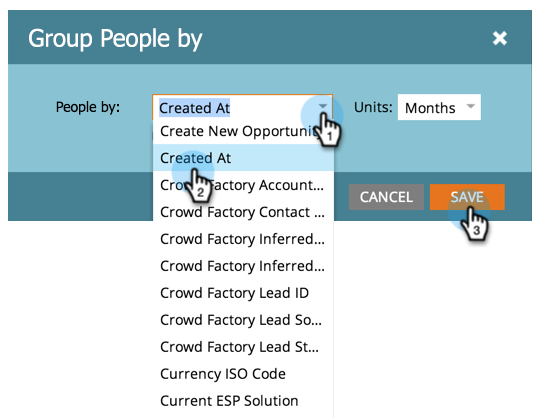

# Informes de persona de grupo por atributo {#group-person-reports-by-attribute}

Puede agrupar los [informes de persona](https://docs.marketo.com/display/docs/basic+reporting) por cualquier persona o atributo de compañía.

1. Vaya al área **Actividades de marketing** (o **Análisis**).

   

1. Seleccione el informe de persona en el árbol de navegación y haga clic en la ficha **Configuración**.

   

1. Haga clic en el doble **Agrupar personas por**.

   

   >[!NOTE]
   >
   >También puede [agrupar los informes de persona por segmento](../../../../product-docs/personalization/segmentation-and-snippets/segmentation/group-person-reports-by-segment.md).

   En el cuadro de diálogo Agrupar personas por, seleccione la persona o el atributo de compañía que se va a utilizar para la agrupación.

   

   >[!TIP]
   >
   >Si elige un atributo que tiene un valor numérico, como *Creado en* o *Ingresos anuales*, seleccione las métricas en la lista desplegable **Unidades** de la derecha.

   ¡Eso es todo! Haga clic en la ficha Informe para ver el informe agrupado según corresponda.

   

   >[!NOTE]
   >
   >**Buceo profundo**
   >
   >
   >Obtenga más información sobre los informes de personas y otros tipos de informes en la [Sistema de informes básico](https://docs.marketo.com/display/docs/basic+reporting)división profunda.

   >[!MORELIKETHIS]
   >
   >
   >    
   >    
   >    * [Añadir columnas personalizadas en un informe de persona](../../../../product-docs/reporting/basic-reporting/editing-reports/add-custom-columns-to-a-person-report.md)

