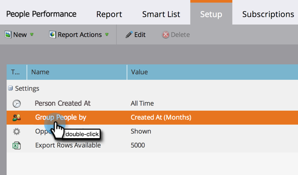

# Informes de persona de grupo por atributo {#group-person-reports-by-attribute}

Puede agrupar los informes [de](http://docs.marketo.com/display/docs/basic+reporting) personas por cualquier persona o atributo de compañía.

>[!NOTE]
>
>**FYI**
>
>Marketo ahora está estandarizando el idioma en todas las suscripciones, por lo que puede ver posibles clientes/posibles clientes en su suscripción y persona/personas en docs.marketo.com. Estos términos significan lo mismo; no afecta a las instrucciones del artículo. También hay otros cambios. [Más información](http://docs.marketo.com/display/DOCS/Updates+to+Marketo+Terminology).

1. Vaya al área Actividades **** de marketing (o **Analytics**).

   

1. Seleccione el informe de persona en el árbol de navegación y haga clic en la ficha **Configuración** .

   

1. Haga clic con el botón doble **Agrupar personas por**.

   

   >[!NOTE]
   >
   >También puede [agrupar los informes de persona por segmento](../../../../product-docs/personalization/segmentation-and-snippets/segmentation/group-person-reports-by-segment.md).

   En el cuadro de diálogo Agrupar personas por, seleccione la persona o el atributo de compañía que se va a utilizar para la agrupación.

   

   >[!TIP]
   >
   >Si selecciona un atributo con un valor numérico, como *Creado en* o Ingresos ** anuales, seleccione las métricas en la lista desplegable **Unidades** de la derecha.

   ¡Eso es todo! Haga clic en la ficha Informe para ver el informe agrupado según corresponda.

   

   >[!NOTE]
   >
   >**Buceo profundo**
   >
   >
   >Obtenga más información sobre los informes de personas y otros tipos de informes en la sección [Básico de informes](http://docs.marketo.com/display/docs/basic+reporting)en profundidad.

   >[!NOTE]
   >
   >**Artículos relacionados**
   >
   >    
   >    
   >    * [Añadir columnas personalizadas en un informe de persona](../../../../product-docs/reporting/basic-reporting/editing-reports/add-custom-columns-to-a-person-report.md)

