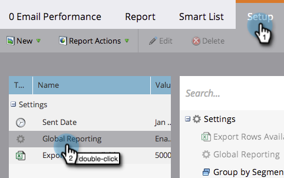

# Correo electrónico del informe, rendimiento de la Campaña en todos los espacios de trabajo {#report-email-campaign-performance-across-workspaces}

Active Global Sistema de informes para incluir datos de todos los espacios de trabajo de Marketing  en los informes [Rendimiento de correo electrónico](/help/marketo/product-docs/email-marketing/email-programs/email-program-data/email-performance-report.md), [Rendimiento de los vínculos de correo electrónico](/help/marketo/product-docs/email-marketing/email-programs/email-program-data/email-link-performance-report.md) y [Actividad de Campaña](/help/marketo/product-docs/reporting/basic-reporting/report-types/campaign-activity-report.md).

1. Vaya al área **Analytics** (o **Actividades de marketing**).

   

1. Seleccione el informe.

   

1. Haga clic en la ficha **Configuración** y haga clic con el doble **Sistema de informes global**.

   

1. Seleccione **Habilitado**.

   

1. ¡Eso es todo! Haga clic en la ficha **Informe** para ver los datos de todos los espacios de trabajo.

   

   >[!MORELIKETHIS]
   >
   >[Filtrar recursos en un informe de correo electrónico](/help/marketo/product-docs/reporting/basic-reporting/report-activity/filter-assets-in-an-email-report.md)
