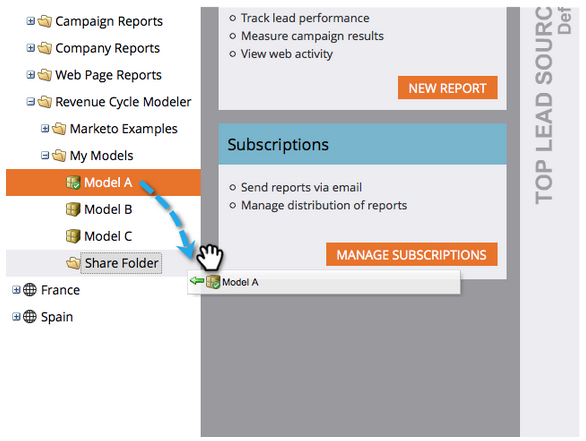

# Compartir un modelo en varios espacios de trabajo {#share-a-model-across-workspaces}

Marketo permite compartir modelos entre espacios de trabajo. Así es cómo se hace.

1. Vaya a la sección **[!UICONTROL Analytics]**.

   

1. Haga clic con el botón derecho en la carpeta **[!UICONTROL Mis modelos]** y luego haga clic en **[!UICONTROL Nueva carpeta]**.

   

1. Asigne un nombre a la carpeta.

   

1. Arrastre los modelos que desee compartir a la **[!UICONTROL carpeta para compartir]**.

   

1. Haga clic con el botón derecho en la carpeta y seleccione **[!UICONTROL Compartir carpeta]**.

   

   >[!NOTE]
   >
   >Compartir un modelo con otro espacio de trabajo permite a esos usuarios ejecutar informes basados en el modelo.

1. Seleccione los espacios de trabajo con los que desea compartir la carpeta y haga clic en **[!UICONTROL Guardar]**.

   

¡Es así de fácil! Ahora las personas de otros espacios de trabajo pueden moverse a través del modelo compartido.
