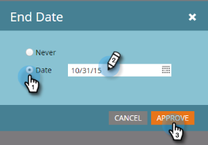
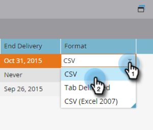

# Editar una Suscripción de Lista inteligente {#edit-a-smart-list-subscription}

Puede editar estas columnas directamente en la ficha Suscripciones, que aparece en Actividades de marketing o en Base de datos:

* Destinatarios
* Frecuencia
* Columnas
* Finalizar Envío
* Formato

1. Seleccione **Base de datos** (la estamos utilizando en este ejemplo, pero Actividades de marketing funciona exactamente igual).

   

1. Seleccione la suscripción que desee editar.

   

1. Haga clic en la columna Destinatarios y se abrirá para que pueda introducir más direcciones de correo electrónico (separarlas con una coma).

   

1. Haga clic en la columna **Frecuencia** para elegir o cambiar la configuración.

   

1. Abra la columna **Columnas** y utilice el selector para agregar o quitar columnas del informe. Las columnas de informes contienen todas las columnas disponibles y las columnas de marketing solo muestran las que ha seleccionado para mostrar en el informe. Haga clic en **Guardar**.

   

   >[!NOTE]
   >
   >Las columnas debajo de Columnas de marketing son las columnas del informe, no las que se utilizan en la ficha del informe Suscripciones.

1. Haga clic en la columna **Fecha de finalización** para editar la fecha de finalización. Seleccione **Nunca** o **Fecha**. Para una fecha, introdúzcala o selecciónela en el calendario. Haga clic en **Aprobar**.

   

1. La última pieza del rompecabezas es el formato. Haga clic en la columna **Formato** y seleccione la que desee. CSV es el valor predeterminado.

   
