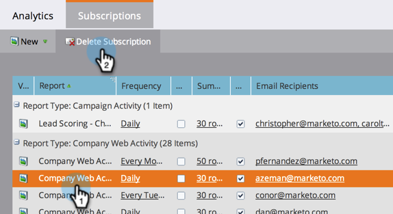

# Administrar suscripciones a informes {#manage-report-subscriptions}

Configurar y eliminar suscripciones a informes.

1. Vaya al área de **[!UICONTROL Analytics]**.

   

1. Haga clic en la ficha **[!UICONTROL Suscripciones]**.

   

   Esta página muestra las suscripciones a todos los informes de su cuenta, agrupados por [tipo de informe](/help/marketo/product-docs/reporting/basic-reporting/report-types/report-type-overview.md). Esto incluye [suscripciones a informes básicos](/help/marketo/product-docs/reporting/basic-reporting/report-subscriptions/subscribe-to-a-basic-report.md) y a informes del Explorador de ciclos de ingresos.

   >[!TIP]
   >
   >También puede administrar suscripciones a un informe individual en **[!UICONTROL Actividades de marketing]**. Seleccione el informe y haga clic en la ficha **[!UICONTROL Suscripciones]**.

   Para cambiar la frecuencia con la que se envía un informe por correo electrónico, haga clic en el campo Frequency y seleccione una nueva opción en el menú desplegable.

   

1. Para cambiar las direcciones de correo electrónico en una suscripción, haga clic en el campo **[!UICONTROL Destinatarios de correo electrónico]** y edite las direcciones de correo electrónico.

   

   >[!TIP]
   >
   >* Utilice comas entre direcciones de correo electrónico.
   >* Para guardar las ediciones, haga clic en un área _fuera_ de la lista de suscripciones.

   También puede:

   * Haga clic en el botón **[!UICONTROL Ver]** para abrir un informe.
   * Anule la selección de la casilla de verificación **[!UICONTROL Activo]** para desactivar la suscripción.
   * Haga clic en y edite el campo **[!UICONTROL Resumen]** para cambiar el número de filas de vista previa que aparecen en el correo electrónico.
   * Anule la selección de la casilla de verificación **[!UICONTROL Excel]** para enviar resúmenes de informes sin el archivo adjunto de hoja de cálculo.
   * Haga clic en el botón **[!UICONTROL Enviar]** para enviar el correo electrónico del informe inmediatamente.

1. Para eliminar una suscripción, seleccione la fila y haga clic en **[!UICONTROL Eliminar suscripción]**.

   

1. Confirme su intención de eliminar la suscripción.

   

   >[!MORELIKETHIS]
   >
   >[Suscribirse a un informe básico](/help/marketo/product-docs/reporting/basic-reporting/report-subscriptions/subscribe-to-a-basic-report.md)

