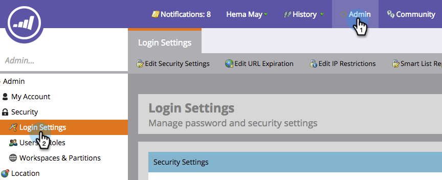

# Proteger la configuración de administración de suscripción {#secure-the-subscription-admin-setting}

>[!NOTE]
>
>**Se requieren permisos de administrador**

Un administrador puede elegir requerir el inicio de sesión para ver un informe.

1. Haga clic en **[!UICONTROL Administrador]** y luego en **[!UICONTROL Configuración de inicio de sesión]**.

   

1. Haga clic en **[!UICONTROL Editar]** para ver la configuración del informe de listas inteligentes.

   

1. Seleccione **[!UICONTROL Sí]** para requerir un inicio de sesión para descargar informes.

   

   >[!CAUTION]
   >
   >Cuando se requiera un inicio de sesión para descargar informes, si no tiene acceso a Marketo, no recibirá correos electrónicos de informes de listas inteligentes. Esto se aplica a las suscripciones actuales y futuras.
