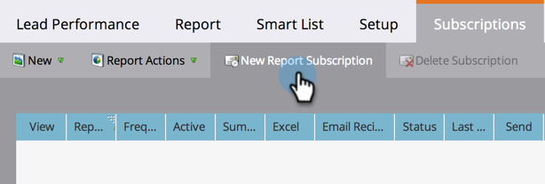

# Suscribirse a un informe básico {#subscribe-to-a-basic-report}

Para recibir actualizaciones automáticas de un informe básico o compartirlo, puede suscribir cualquier dirección de correo electrónico a un informe existente.

1. Vaya al área **[!UICONTROL Actividades de marketing]**.

   

1. Seleccione el informe en el árbol de navegación y haga clic en la ficha **[!UICONTROL Suscripciones]**.

   

   >[!NOTE]
   >
   >También puede suscribirse a informes desde la ficha **[!UICONTROL Analytics]**.

1. Haga clic en **[!UICONTROL Nueva suscripción a informe]**.

   

1. Introduzca las direcciones de correo electrónico y defina la frecuencia de los correos electrónicos de los informes.

   

   >[!NOTE]
   >
   >Cualquiera puede cancelar la suscripción al informe en el correo electrónico que reciba.

   

   >[!MORELIKETHIS]
   >
   >Aprenda a [administrar todas las suscripciones a informes](/help/marketo/product-docs/reporting/basic-reporting/report-subscriptions/manage-report-subscriptions.md) en un solo lugar.
