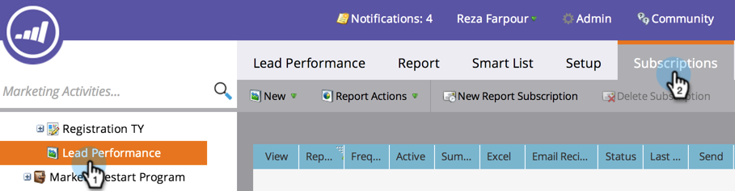

# Suscripción a un informe básico {#subscribe-to-a-basic-report}

Para recibir actualizaciones automáticas de un [informe básico](https://docs.marketo.com/display/docs/basic+reporting), o para compartirlas, puede suscribirse a cualquier dirección de correo electrónico de un informe existente.

>[!NOTE]
>
>Para obtener suscripciones de informes [Explorador del ciclo de ingresos](https://docs.marketo.com/display/docs/revenue+cycle+analytics), consulte [Suscribirse a un informe del Explorador de ingresos](../../../../product-docs/reporting/revenue-cycle-analytics/revenue-explorer/subscribe-to-a-revenue-explorer-report.md).

1. Vaya al área **Actividades de mercadotecnia **.

   

1. Seleccione el informe en el árbol de navegación y haga clic en la ficha **Suscripciones**.

   

   >[!NOTE]
   >
   >También puede suscribirse a informes desde la ficha **Analytics**.

1. Haga clic en **Nueva Suscripción de informe**.

   

1. Escriba las direcciones de correo electrónico y establezca la frecuencia de los mensajes de correo electrónico del informe.

   

   >[!NOTE]
   >
   >Cualquiera puede cancelar la suscripción al informe en el correo electrónico que reciba.

   ¡Eso es todo! ¡Revisa tu bandeja de entrada!

   

   >[!MORELIKETHIS]
   >
   >
   >
   >Obtenga información sobre cómo [administrar todas sus suscripciones de informes](manage-report-subscriptions.md) en un solo lugar.

   >[!NOTE]
   >
   >**Buceo profundo**
   >
   >
   >Vea qué más puede hacer con los informes en la división profunda [Sistema de informes básico](https://docs.marketo.com/display/docs/basic+reporting).

