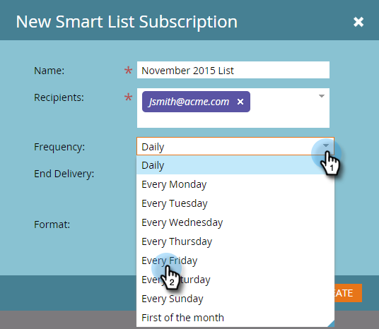

# Suscribirse a una lista inteligente {#subscribe-to-a-smart-list}

La suscripción a listas inteligentes es una buena manera de realizar un seguimiento de las personas, ya que los informes se envían directamente a la bandeja de entrada.

Puede crear una suscripción a una lista inteligente en dos lugares independientes:

* [!UICONTROL Actividades de mercadotecnia]
* [!UICONTROL Base de datos]

Las suscripciones utilizan la lista completa de personas en el momento en que se ejecuta la suscripción.

Las suscripciones se almacenan donde se encuentra tu lista inteligente, en [!UICONTROL Actividades de marketing] o [!UICONTROL Base de datos].

Puede crear varias suscripciones a partir de la misma lista inteligente.

Las suscripciones son específicas de Workspace. Por ejemplo, esta lista de suscripciones está en un espacio de trabajo diferente de las que se muestran en el resto de este artículo:

>[!NOTE]
>
>Tiene un límite de 100 suscripciones y un máximo de 100 000 personas por suscripción, en espacios de trabajo y por instancia de Marketo. Si la lista inteligente contiene más de 100 000 nombres, Marketo ejecutará la suscripción para los primeros 100 000.

## Crear una suscripción a una lista inteligente {#create-a-smart-list-subscription}

1. Vaya a la **[!UICONTROL base de datos]** o a **[!UICONTROL Actividades de marketing]**.

   

1. Seleccione la lista inteligente para la que desea crear una suscripción. Haga clic en **[!UICONTROL Acciones de lista]** y seleccione **[!UICONTROL Nueva suscripción a lista inteligente]**.

   

1. Asigne a su suscripción un **[!UICONTROL Nombre]** y, a continuación, seleccione o escriba las direcciones de correo electrónico de los **[!UICONTROL Destinatarios]**.

   

1. Haga clic en la lista **[!UICONTROL Frecuencia]** y seleccione una frecuencia.

   

1. Establezca la fecha **[!UICONTROL Finalizar envío]**. Puede seleccionar **[!UICONTROL Nunca]** o una fecha de calendario.

   

1. Haga clic en **[!UICONTROL Formato]** y elija en la lista.

   

1. Haga clic en **[!UICONTROL Crear]**.

   

1. La nueva suscripción a la lista inteligente aparece en la parte superior de la lista de la pestaña Suscripciones. Haz clic en **[!UICONTROL Enviar]** si deseas enviar ahora y no esperar hasta la entrega de correo electrónico programada.

   

1. Le recomendamos que borre la casilla de verificación **[!UICONTROL Activo]** para desactivar una suscripción a una lista inteligente si nadie está suscrito a ella.

   

   Eso fue fácil, ¿no?

## Mensaje de correo electrónico {#email-message}

Los destinatarios recibirán un correo electrónico con una opción para descargar el informe, así como un vínculo directamente a la lista dentro de la instancia de Marketo. El vínculo de descarga caduca en cuatro días.

>[!NOTE]
>
>Si la opción [Administrador de suscripción segura](/help/marketo/product-docs/reporting/basic-reporting/report-subscriptions/secure-the-subscription-admin-setting.md) está establecida en **[!UICONTROL Sí]**, solamente las personas con acceso a la instancia de Marketo podrán descargar el informe.

Si un informe no contiene ninguna persona, los destinatarios seguirán recibiendo un correo electrónico. Sin embargo, el correo electrónico simplemente indica que no hay personas de las que informar.

>[!NOTE]
>
>Al modificar un filtro de lista inteligente en el que se basa una suscripción, también se actualiza el informe.

El correo electrónico también proporciona información adicional sobre los filtros utilizados para crear la lista.

## Eliminar una suscripción {#delete-a-subscription}

Para eliminar una suscripción, selecciónela en la ficha Suscripciones y haga clic en **[!UICONTROL Eliminar suscripción]**.

>[!MORELIKETHIS]
>
>* [Editar una suscripción a lista inteligente](/help/marketo/product-docs/reporting/basic-reporting/report-subscriptions/edit-a-smart-list-subscription.md)
>* [Proteger la configuración de administración de suscripciones](/help/marketo/product-docs/reporting/basic-reporting/report-subscriptions/secure-the-subscription-admin-setting.md)
