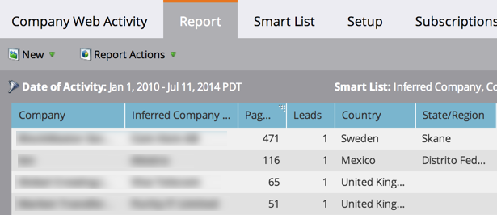

# Informe Actividad Web de compañía {#company-web-activity-report}

Ver qué compañías visitan el sitio Web. Puede elegir mostrar visitantes conocidos o anónimos, pero no ambos en el mismo informe.

Cree un [informe de Actividad de página Web](/help/marketo/product-docs/reporting/basic-reporting/report-types/web-page-activity-report.md) para ver las personas individuales que visitan el sitio.

>[!PREREQUISITES]
>
>Para capturar la actividad de su sitio Web en Marketing, primero debe configurar [Munchkin en su sitio](/help/marketo/product-docs/administration/additional-integrations/add-munchkin-tracking-code-to-your-website.md).

1. [Cree un ](/help/marketo/product-docs/reporting/basic-reporting/creating-reports/create-a-report-in-a-program.md) informe y seleccione el tipo [ de ](report-type-overview.md)informe Actividad Web de Compañía.

1. Elija [mostrar personas conocidas o anónimas](/help/marketo/product-docs/reporting/basic-reporting/report-activity/display-people-or-anonymous-visitors-in-web-reports.md) en el informe.

1. [Configure el intervalo de tiempo del ](/help/marketo/product-docs/reporting/basic-reporting/editing-reports/change-a-report-time-frame.md) informe y haga clic en la ficha  **** Informe.

1. ¡Eso es todo! Revise el informe para ver qué compañías visitan el sitio.

   

   >[!TIP]
   >
   >Para encontrar las compañías que más visitan el sitio, [ordene el informe](/help/marketo/product-docs/reporting/basic-reporting/editing-reports/sort-report-on-columns.md) en la columna _Vistas de página_ y elija **Ordenar De bajada**.

   [Las columnas que puede ](/help/marketo/product-docs/reporting/basic-reporting/editing-reports/select-report-columns.md) seleccionar para un informe de Actividad Web de Compañía incluyen:

<table> 
 <thead> 
  <tr> 
   <th>Columnas</th> 
   <th>Descripción</th> 
  </tr> 
 </thead> 
 <tbody> 
  <tr> 
   <td>Compañía</td> 
   <td>La compañía de los visitantes.  <strong>Los nombres en </strong> boldare se confirman como el nombre de la compañía por al menos una persona.</td> 
  </tr> 
  <tr> 
   <td>Compañía preferida o ISP</td> 
   <td>La compañía, según se infiere de la dirección IP de los visitantes.   <strong>Los nombres en </strong> negrita indican que esta es la compañía, no el ISP. </td> 
  </tr> 
  <tr> 
   <td>Vistas de página</td> 
   <td>Número de páginas cargadas por los visitantes.</td> 
  </tr> 
  <tr> 
   <td>Personas</td> 
   <td>Número de personas de esta compañía que visitaron el sitio.</td> 
  </tr> 
  <tr> 
   <td>País, estado/región y ciudad</td> 
   <td>Ubicación geográfica de la compañía.</td> 
  </tr> 
  <tr> 
   <td>Primera/Última visita (huso horario)</td> 
   <td>Fecha y hora de la primera/última visita de cualquiera de esta compañía.</td> 
  </tr> 
 </tbody> 
</table>

>[!MORELIKETHIS]
>
>[Mostrar personas o Visitantes anónimos en informes web](/help/marketo/product-docs/reporting/basic-reporting/report-activity/display-people-or-anonymous-visitors-in-web-reports.md)
