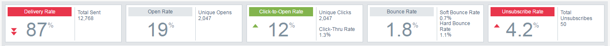

# Información general de Analytics de perspectivas de correo electrónico {#email-insights-analytics-overview}

En [!UICONTROL Analytics], explore los datos agregados para la entrega y la participación por correo electrónico. Utilice el gráfico de la izquierda para explorar los datos y las perspectivas de la derecha para disfrutar de una experiencia más guiada.

[El filtrado](/help/marketo/product-docs/reporting/email-insights/filtering-in-email-insights.md) está disponible para ayudarle a explorar en profundidad métricas específicas.

Los mosaicos de puntos de interés clave (KPI) le proporcionan una visión rápida de las métricas más populares.

Pase el ratón sobre los mosaicos de KPI para obtener más información...

... o vea los detalles sin tener que pasar el ratón por encima de la ventana del navegador (en pantallas más grandes).

>[!TIP]
>
>¡Esos colores significan algo! El verde indica un buen cambio, el rojo significa un mal cambio, el gris significa que nada ha cambiado. Esto se basa en el periodo de comparación elegido en el filtrado.

El gráfico muestra los criterios filtrados. Para ocultar uno de los filtros, simplemente haga clic en su barra de color...

... y la métrica desaparece del gráfico. Vuelva a hacer clic en la barra de color para que vuelva a aparecer.

Si deseas volver a crear un gráfico, conviértelo en un [gráfico rápido](/help/marketo/product-docs/reporting/email-insights/email-insights-quick-charts.md).

En el lado derecho de la página, las métricas guiadas le ayudan a descubrir controladores relevantes. Haga clic en cualquier métrica para verla en el gráfico de la izquierda de la página.

>[!NOTE]
>
>¿Ves esa [!UICONTROL actualización] en la esquina superior derecha? Cuando lo vea, tendrá que hacer clic manualmente para actualizar el módulo de Insights. Solo se muestra cuando se ha realizado un cambio en los filtros que invalida los valores actuales.

También puede especificar lo que ve (de izquierda a derecha): Todos, Audiencia, Contenido y Plataforma.

>[!MORELIKETHIS]
>
>[Información general sobre envíos de correo electrónico](/help/marketo/product-docs/reporting/email-insights/email-insights-sends-overview.md)
