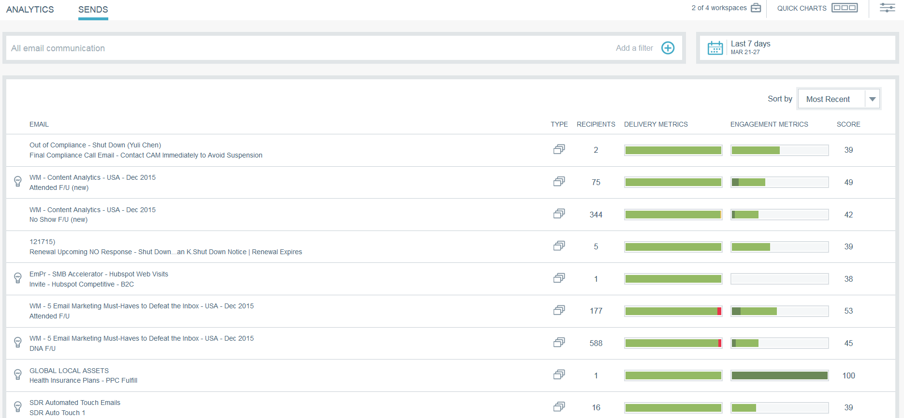

# Información general de perspectivas de correo electrónico {#email-insights-overview}

Las perspectivas de correo electrónico proporcionan información valiosa sobre los datos históricos de los especialistas en mercadotecnia de correo electrónico. Consta de dos secciones separadas pero asociadas: Analytics y envíos.

Para acceder a las perspectivas de correo electrónico, haga clic en su mosaico en Mi marketing (o en la pantalla de inicio de Analytics).

>[!NOTE]
>
>De forma predeterminada, verá los datos de cada espacio de trabajo al que tenga acceso. Puede anular la selección de los espacios de trabajo que no desee vista. Se recordarán sus selecciones en adelante.

## Analytics {#analytics}

Utilice [Analytics](/help/marketo/product-docs/reporting/email-insights/email-insights-analytics-overview.md) para explorar los datos acumulados de series temporales para las métricas de envío y participación de correo electrónico.

**Filtros**

Se utilizan [filtros](/help/marketo/product-docs/reporting/email-insights/filtering-in-email-insights.md) avanzados para desglosar los resultados por Audiencia, Contenido o Plataforma. Los mismos filtros se aplican tanto a Analytics como a Envíos.

**Gráficos rápidos**

[Las miniaturas de ](/help/marketo/product-docs/reporting/email-insights/email-insights-quick-charts.md) gráficos rápidos se crean y guardan, lo que proporciona una vista rápida de los gráficos que son importantes para usted.

## Envía {#sends}

En la página [Envíos](/help/marketo/product-docs/reporting/email-insights/email-insights-sends-overview.md), examine las características de la comunicación por correo electrónico reciente.

**Métricas**

Haga clic en las barras Métricas para traducir los colores en números.

>[!NOTE]
>
>Los datos pueden tardar hasta 8 horas en reflejarse en las perspectivas de correo electrónico.

## Dimension personalizados {#custom-dimensions}

Se incluyen todas las dimensiones estándar de marketing, pero puede agregar hasta 10 dimensiones personalizadas. [Las ](/help/marketo/product-docs/reporting/email-insights/custom-dimensions-for-email-insights.md) dimensiones personalizadas constan de segmentaciones y etiquetas de programa.

>[!MORELIKETHIS]
>
>* [Información general de análisis de perspectivas de correo electrónico](/help/marketo/product-docs/reporting/email-insights/email-insights-analytics-overview.md)
>* [Información general sobre las perspectivas de correo electrónico](/help/marketo/product-docs/reporting/email-insights/email-insights-sends-overview.md)

