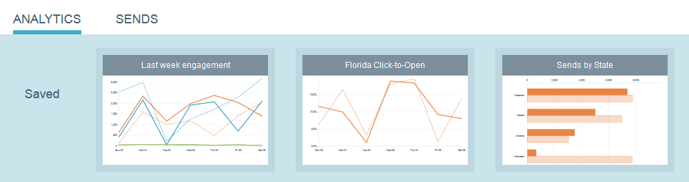
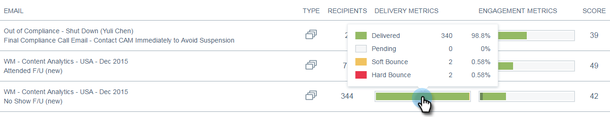

# Información general de perspectivas del correo electrónico {#email-insights-overview}

**[!UICONTROL Perspectivas de correo electrónico]** proporciona información valiosa a partir de datos históricos para los especialistas en marketing por correo electrónico. Consta de dos secciones separadas pero asociadas: [!UICONTROL Analytics] y [!UICONTROL Sends].

Para acceder a **[!UICONTROL Email Insights]**, simplemente haga clic en su mosaico en Mi Marketo (o en la pantalla de inicio de Analytics).

>[!NOTE]
>
>De forma predeterminada, verá los datos de todos los espacios de trabajo a los que tenga acceso. Puede anular la selección de espacios de trabajo que no desee ver. Sus selecciones se recordarán a partir de ahora.

## [!UICONTROL Analytics] {#analytics}

Use [[!UICONTROL Analytics]](/help/marketo/product-docs/reporting/email-insights/email-insights-analytics-overview.md) para explorar los datos de series de tiempo agregados para las métricas de participación y envío de correo electrónico.

**Filtros**

Se han utilizado [filtros](/help/marketo/product-docs/reporting/email-insights/filtering-in-email-insights.md) avanzados para desglosar los resultados por audiencia, contenido o plataforma. Los mismos filtros se aplican a [!UICONTROL Analytics] y [!UICONTROL Sends].

**Gráficos rápidos**

[Los gráficos rápidos](/help/marketo/product-docs/reporting/email-insights/email-insights-quick-charts.md) son miniaturas que usted crea y guarda, y proporcionan una vista rápida de los gráficos que son importantes para usted.

## [!UICONTROL Envía] {#sends}

En la página [[!UICONTROL Envíos]](/help/marketo/product-docs/reporting/email-insights/email-insights-sends-overview.md), examine las características de las comunicaciones por correo electrónico recientes.

**Métricas**

Haga clic en las barras de métricas para traducir los colores en números.

>[!NOTE]
>
>Los datos pueden tardar hasta 8 horas en reflejarse en **[!UICONTROL Perspectivas de correo electrónico]**.

## Dimensiones personalizadas {#custom-dimensions}

Se incluyen todas las dimensiones estándar de Marketo, pero tiene la opción de añadir hasta 10 dimensiones personalizadas. [Las dimensiones personalizadas](/help/marketo/product-docs/reporting/email-insights/custom-dimensions-for-email-insights.md) constan de segmentaciones y etiquetas de programa.

>[!MORELIKETHIS]
>
>* [Información general sobre Email Insights Analytics](/help/marketo/product-docs/reporting/email-insights/email-insights-analytics-overview.md)
>* [Información general sobre envíos de correo electrónico](/help/marketo/product-docs/reporting/email-insights/email-insights-sends-overview.md)
