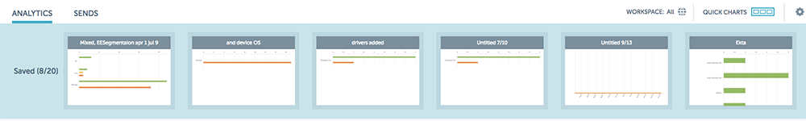

# Gráficos rápidos de perspectivas de correo electrónico {#email-insights-quick-charts}

Los gráficos rápidos son miniaturas que puede personalizar y guardar, lo que proporciona una vista rápida de los gráficos que más utiliza.

## Crear un nuevo gráfico rápido {#create-a-new-quick-chart}

En este ejemplo, elegiremos la tasa de apertura para las primeras tres semanas de febrero de 2016 en los estados de California y Florida.

1. Haga clic en el filtro de fecha que aparece a la derecha de la pantalla de [!UICONTROL Analytics].

   

1. Elija el intervalo de fechas deseado.

   

1. Cuando haya seleccionado el intervalo de fechas, haga clic en **[!UICONTROL Aplicar]**.

   

1. El gráfico cambia después de aplicar las fechas.

   

1. Haga clic en la primera lista desplegable. Haga clic en para seleccionar los criterios (si aún no están seleccionados) y anule la selección de cualquier criterio no deseado.

   

1. En el lado derecho del gráfico, haga clic en el icono de exportación y seleccione **[!UICONTROL Guardar como gráfico rápido]**.

   

1. Asigne un nombre al gráfico rápido y haga clic en **[!UICONTROL Guardar]**.

   

   >[!NOTE]
   >
   >Puede tener hasta 20 Gráficos rápidos. Se pueden eliminar y reemplazar.

1. El nuevo gráfico rápido aparecerá con los demás.

   

   >[!TIP]
   >
   >Para mover cualquier gráfico rápido, haga clic en y arrástrelo a la posición deseada.

## Eliminar un gráfico rápido {#delete-a-quick-chart}

¿Desea eliminar uno de sus gráficos rápidos? ¡Es fácil!

1. Haga clic en el icono **[!UICONTROL Gráficos rápidos]**.

   

1. Pase el ratón sobre el gráfico que quiera, pero no haga clic en él. Al pasar el ratón por encima, aparecerá una X. Haga clic en **X**.

   

1. Haga clic en **[!UICONTROL Ok]**.

   

   Se ha eliminado el gráfico rápido. Te dije que era fácil.
