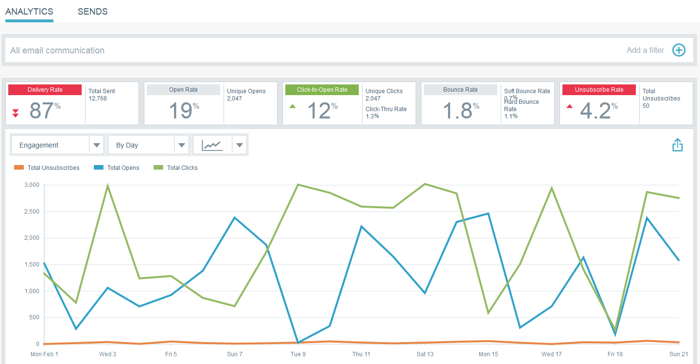

# Gráficos rápidos de perspectivas de correo electrónico {#email-insights-quick-charts}

Los gráficos rápidos son miniaturas que puede personalizar y guardar, lo que proporciona una vista rápida de los gráficos que utiliza con mayor frecuencia.

## Crear un nuevo gráfico rápido {#create-a-new-quick-chart}

En este ejemplo, elegiremos la tarifa abierta para las primeras tres semanas de febrero de 2016, en los estados de California y Florida.

1. Haga clic en el filtro de fecha a la derecha de la pantalla de Analytics.

   

1. Elija el intervalo de fechas deseado.

   

1. Cuando el intervalo de fechas esté seleccionado, haga clic en **Aplicar**.

   

1. El gráfico cambia después de que se hayan aplicado las fechas.

   

1. Haga clic en la primera lista desplegable. Haga clic para seleccionar los criterios (si no está seleccionado ya) y anule la selección de los criterios no deseados.

   

1. En el lado derecho del gráfico, haga clic en el icono de exportación y seleccione **Guardar como gráfico rápido**.

   

1. Asigne un nombre al gráfico rápido y haga clic en **Guardar**.

   

   >[!NOTE]
   >
   >Puede tener hasta 20 gráficos rápidos. Se pueden eliminar y reemplazar.

1. El nuevo gráfico rápido aparecerá con los demás.

   

   ¡Y eso es todo!

   >[!TIP]
   >
   >Para mover cualquier gráfico rápido, haga clic y arrástrelo a la posición deseada.

## Eliminar un gráfico rápido {#delete-a-quick-chart}

¿Desea eliminar uno de los gráficos rápidos? ¡Es fácil!

1. Haga clic en el icono **Gráficos rápidos**.

   

1. Pase el ratón sobre el gráfico deseado, pero no haga clic en él. Al pasar el ratón por encima, aparecerá una X. Haga clic en **X**.

   

1. Haga clic en **Aceptar**.

   

   El gráfico rápido se ha eliminado. Te dije que era fácil.
