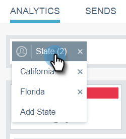

# Filtrado de perspectivas de correo electrónico {#filtering-in-email-insights}

En las perspectivas de correo electrónico, existen diferentes maneras de filtrar los datos.

## Perspectivas de correo electrónico {#email-insights}

Haga clic en el inicio + para agregar filtros. Añada tantos como desee.

Si tiene más de un filtro en la misma categoría, se combinarán y mostrarán la cantidad.

Si alguna vez necesita ver qué filtros ha aplicado, simplemente haga clic en el filtro. Puedes añadir más allá.

También puede agregar tipos adicionales de filtros.

¡Y aún más filtros!

El gráfico cambia después de aplicar cada filtro.

Para eliminar una categoría, haga clic en su X.

Para borrar todos los filtros, haga clic en la X al final de la barra de filtros.

Para datos específicos de fecha, utilice intervalos de fechas.

Elija entre intervalos de fechas preestablecidos comunes, seleccione fechas específicas e incluso utilice el período anterior para la comparación.

>[!NOTE]
>
>Los intervalos de fechas se aplican tanto a la página de Analytics como a la página de envíos. Sin embargo, la opción **Comparar** solo se aplica a la página Análisis.

## Marketing basado en cuentas {#account-based-marketing}

Si utiliza [Administración de cuentas de Destinatario](https://docs.marketo.com/display/DOCS/Account+Based+Marketing+Overview), existen filtros específicos para usted.

