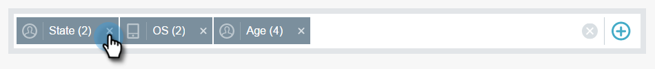
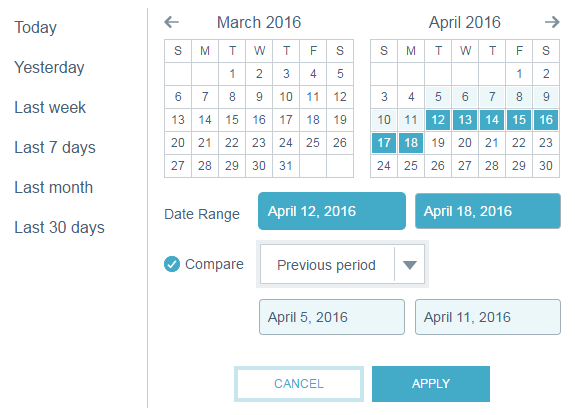
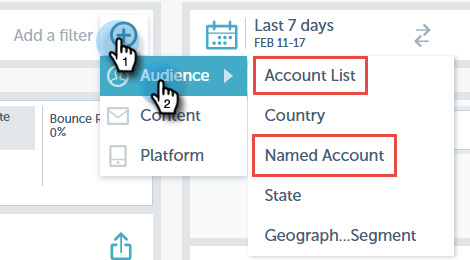

# Filtrado en [!UICONTROL Insights de correo electrónico] {#filtering-in-email-insights}

En [!UICONTROL Email Insights], hay diferentes maneras de filtrar tus datos.

## [!UICONTROL Perspectivas de correo electrónico] {#email-insights}

Haga clic en + para empezar a añadir filtros. Añada tantos como desee.

Si tiene más de un filtro en la misma categoría, se combinarán y se mostrará la cantidad.

Si alguna vez necesita ver qué filtros ha aplicado, simplemente haga clic en el filtro. Incluso puede añadir más allí.

También puede añadir tipos de filtros adicionales.

¡Y aún más filtros!

El gráfico cambia después de aplicar cada filtro.

Para eliminar una categoría, haga clic en su X.

Para borrar todos los filtros, haga clic en la X situada al final de la barra de filtros.

Para datos específicos de fecha, utilice intervalos de fecha.

Elija entre intervalos de fechas preestablecidos comunes, seleccione fechas específicas e incluso utilice el periodo anterior para la comparación.

>[!NOTE]
>
>Los intervalos de fechas se aplican tanto a la página [!UICONTROL Analytics] como a la página [!UICONTROL Envía]. Sin embargo, la opción **Comparar** solo se aplica a la página [!UICONTROL Analytics].

## Marketing basado en la cuenta {#account-based-marketing}

Si usa [[!UICONTROL Administración de cuentas de Target]](https://docs.marketo.com/display/DOCS/Account+Based+Marketing+Overview), hay filtros específicos para usted.

