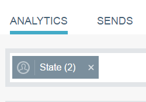

# Filtrado en Perspectivas de correo electrónico {#filtering-in-email-insights}

En Perspectivas de correo electrónico, existen diferentes formas de filtrar los datos.

## Información del email {#email-insights}

Haga clic en + para empezar a añadir filtros. Añada tantos como desee.

Si tiene más de un filtro en la misma categoría, se combinarán y mostrarán la cantidad.

Si alguna vez necesita ver qué filtros ha aplicado, simplemente haga clic en el filtro . Incluso puede agregar más allí.

También puede añadir tipos de filtros adicionales.

¡Y aún más filtros!

El gráfico cambia después de aplicar cada filtro.

Para eliminar una categoría, haga clic en su X.

Para borrar todos los filtros, haga clic en la X situada al final de la barra de filtros.

Para datos específicos de fechas, utilice intervalos de fechas.

Elija entre intervalos de fechas preestablecidos comunes, seleccione fechas específicas e incluso utilice el periodo anterior para la comparación.

>[!NOTE]
>
>Los intervalos de fechas se aplican tanto a la página de Analytics como a la de Envíos . La variable **Comparar** no obstante, esta opción solo se aplica a la página de Analytics.

## Marketing basado en la cuenta {#account-based-marketing}

Si usa [Administración de cuentas de Target](https://docs.marketo.com/display/DOCS/Account+Based+Marketing+Overview), hay filtros específicos para usted.

