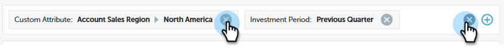

# Filtrado en perspectivas de rendimiento {#filtering-in-performance-insights}

Filtre fácilmente los datos para consultar información específica.

Haga clic en + para empezar a añadir filtros.

>[!NOTE]
>
>En este momento, los atributos personalizados están disponibles en filtros únicamente para los clientes que tengan habilitado el análisis de ciclo de ingresos.

Al hacer clic en una categoría, aparecen varias subcategorías.

Elija una subcategoría y busque o seleccione un valor.

Los gráficos se actualizan para reflejar los filtros seleccionados.

Puede agregar filtros adicionales siguiendo los mismos pasos.

Puede quitar un filtro en cualquier momento haciendo clic en la X que hay junto a él. Elimine todos los filtros a la vez haciendo clic en la X situada en el extremo derecho.

## Filtros disponibles {#available-filters}

<table> 
 <tbody> 
  <tr> 
   <td colspan="1"><strong>Lista de cuentas de ABM</strong></td> 
   <td colspan="1">Si utiliza Marketo ABM, todas sus listas de cuentas se sincronizarán con MPI y serán visibles a través del filtro "Lista de cuentas ABM". Puede seleccionar una lista de cuentas para filtrar los resultados a esas cuentas.<a href="https://docs.marketo.com/display/public/DOCS/Account-Based+Web+Marketing+with+ABM" rel="nofollow">Obtenga más información sobre las listas de cuentas de ABM.</a></td> 
  </tr> 
  <tr> 
   <td colspan="1"><strong>Cuenta con nombre ABM</strong></td> 
   <td colspan="1">Si utiliza Marketo ABM, todas sus cuentas con nombre se sincronizarán con MPI y serán visibles a través del filtro "Cuenta con nombre ABM". Puede seleccionar una cuenta con nombre para filtrar los resultados a esas cuentas.<a href="https://docs.marketo.com/x/eaCt" rel="nofollow">Obtenga más información sobre las cuentas con nombre ABM.</a></td> 
  </tr> 
  <tr> 
   <td colspan="1"><strong>Atributos personalizados</strong></td> 
   <td colspan="1">
Estas son determinadas por usted. Todos los campos <a href="/help/marketo/product-docs/reporting/revenue-cycle-analytics/revenue-tools/enabling-custom-field-sync-for-revenue-cycle-analytics.md" rel="nofollow">active</a> para el análisis de oportunidades, puede filtrarse en Perspectivas de rendimiento .
</td> 
  </tr> 
  <tr> 
   <td colspan="1">
<strong>Período de inversión</strong>
</td> 
   <td colspan="1">
Período de tiempo del costo del programa.
</td> 
  </tr> 
  <tr> 
   <td colspan="1">
<strong>Tipo de oportunidad</strong>
</td> 
   <td colspan="1">
Tipo de oportunidad tal como se ha configurado en el objeto Oportunidad en la configuración de Salesforce (CRM).
</td> 
  </tr> 
  <tr> 
   <td>
<strong>Etiqueta de programa</strong>
</td> 
   <td>
Las etiquetas se utilizan para describir programas. Puede hacer todo lo que necesite, cada uno con valores únicos. <a href="/help/marketo/product-docs/administration/tags/create-a-new-program-tag-and-tag-values.md" rel="nofollow">Aprenda a trabajar con etiquetas de programa aquí.</a>
</td> 
  </tr> 
  <tr> 
   <td><strong>Espacio de trabajo</strong></td> 
   <td>
Los espacios de trabajo son áreas independientes en Marketo que contienen recursos de marketing, como: programas, páginas de aterrizaje, correos electrónicos y más. <a href="/help/marketo/product-docs/administration/workspaces-and-person-partitions/understanding-workspaces-and-person-partitions.md" rel="nofollow">Obtenga más información sobre los espacios de trabajo aquí.</a>
</td> 
  </tr> 
 </tbody> 
</table>

>[!NOTE]
>
>En el panel Participación, solo están disponibles las etiquetas de programa y los filtros de espacio de trabajo.
