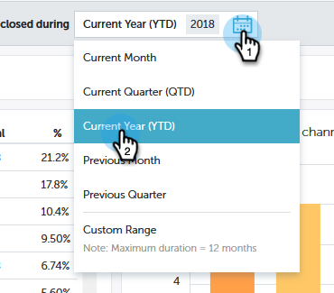

# Información general de contribución de perspectivas de rendimiento {#performance-insights-contribution-overview}

En Perspectivas de rendimiento de marketing, la vista de contribución se muestra de forma predeterminada.

Seleccione la métrica por la que desee realizar la vista del rendimiento. En este ejemplo analizaremos las oportunidades ganadas mediante Multi-Touch en el panel de ingresos.

>[!NOTE]
>
>Obtenga información sobre [Primer toque y Multitoque](/help/marketo/product-docs/reporting/revenue-cycle-analytics/revenue-tools/attribution/understanding-attribution.md).

Elija para qué período desea ver las métricas. En este ejemplo estamos viendo el año actual (año hasta la fecha).

>[!NOTE]
>
>Se ha eliminado temporalmente la selección &quot;Año anterior&quot;. Todavía tiene la opción de ver los datos de rendimiento del año anterior utilizando la selección Intervalo personalizado.

Las métricas se presentan mediante dos gráficos: anacardos y bar.

El gráfico de anillos muestra los diez canales principales de la métrica seleccionada.

El gráfico de barras muestra el rendimiento del programa en todos los canales (diez programas a la vez) de la métrica seleccionada. Para ver más, haga clic en la flecha de la derecha para desplazarse al siguiente grupo.

>[!TIP]
>
>Si desea que las barras del gráfico se escalen a medida que se desplaza por los grupos, seleccione la casilla **Escalar eje Y para que encaje**.

Pase el ratón sobre una barra para ver más detalles.

Seleccione uno o varios canales en el gráfico de anillos y todos los programas asociados con esos canales aparecerán en el gráfico de barras a la derecha. Vuelva a hacer clic en los canales para anular la selección.

La cuadrícula de datos siguiente funciona como una hoja de cálculo, que muestra todas las métricas disponibles bajo el modelo de atribución seleccionado (Primer toque/Multitoque). Se resalta la columna que contiene la métrica elegida.

| **Oportunidades ganadas** | La porción de crédito (en valor numérico) que el programa recibió por influir en la oportunidad ganada |
|---|---|
| **Ganancia de ingresos** | Parte del crédito (en valor monetario) que el programa recibió por influir en la oportunidad que se le ofrecía |
| **Costo** | Coste total del programa |
| **Costo por oportunidad ganado** | La relación entre el costo del programa y la parte del crédito (en valor numérico) que el programa recibió para influir en la creación de nuevas oportunidades |
| **Tasa de ganancias por costo** | La relación de la parte del crédito (en valor monetario) que el programa recibió por influir en las oportunidades obtenidas y en el coste del programa |

Expanda un canal para ver sus diez programas principales, con los programas restantes combinados.

>[!NOTE]
>
>Al hacer clic en la casilla de verificación situada junto a un canal, se activa o desactiva en el gráfico de anillos de arriba.
