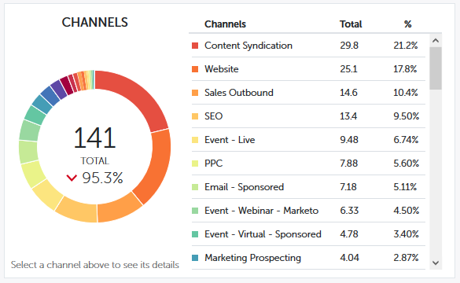

# Información general sobre la contribución de Perspectivas de rendimiento {#performance-insights-contribution-overview}

En Perspectivas de rendimiento de Marketo, la vista Contribución se muestra de forma predeterminada.

Seleccione la métrica por la que desea ver el rendimiento. En este ejemplo, veremos las oportunidades ganadas mediante Multi-Touch en el panel Ingresos.

>[!NOTE]
>
>Obtenga información sobre [Primer toque y multitáctil](/help/marketo/product-docs/reporting/revenue-cycle-analytics/revenue-tools/attribution/understanding-attribution.md).

Elija para qué periodo desea ver las métricas. En este ejemplo estamos viendo el año actual (año hasta la fecha).

>[!NOTE]
>
>Se ha eliminado temporalmente la selección &quot;Año anterior&quot;. Aún tiene la opción de ver todos los datos de rendimiento del año anterior mediante la selección Intervalo personalizado .

Las métricas se presentan mediante dos gráficos: anacardos y barra.

El gráfico de anillos muestra los diez canales principales de la métrica seleccionada.

El gráfico de barras muestra el rendimiento del programa en todos los canales (diez programas a la vez) para la métrica seleccionada. Para obtener más información, haga clic en la flecha de la derecha para desplazarse al grupo siguiente.

>[!TIP]
>
>Si desea que las barras del gráfico se amplíen a medida que se desplaza por los grupos, seleccione la **Escalar el eje Y para ajustarlo** casilla de verificación.

Pase el ratón sobre una barra para ver más detalles.

Seleccione uno o varios canales en el gráfico de anillos y todos los programas asociados a esos canales aparecen en el gráfico de barras de la derecha. Vuelva a hacer clic en los canales para anular la selección.

La siguiente cuadrícula de datos funciona como una hoja de cálculo que muestra todas las métricas disponibles bajo el modelo de atribución elegido (Primer toque/Multitoque). Se resalta la columna que contiene la métrica elegida.

| **Oportunidades ganadas** | La porción de crédito (en valor numérico) que el programa recibió por influir en la oportunidad ganada |
|---|---|
| **Ganancias** | La porción de crédito (en valor monetario) que el programa recibió por influir en la oportunidad que se le presentó |
| **Costo** | Coste total del programa |
| **Costo por oportunidad ganado** | La relación entre el costo del programa y la parte del crédito (en valor numérico) que el programa recibió para influir en la creación de nuevas oportunidades |
| **Proporción De Ingresos Ganados Por Coste** | La proporción de la parte del crédito (en valor monetario) que el programa recibió para influir en las oportunidades obtenidas y el costo del programa |

Expanda un canal para ver sus diez programas principales, con los programas restantes combinados.

>[!NOTE]
>
>Al hacer clic en la casilla de verificación situada junto a un canal, actívela o desactívela en el gráfico de anillos anterior.
