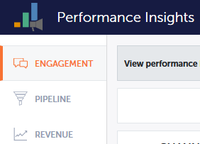
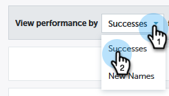
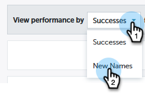

# Paneles de perspectivas de rendimiento {#performance-insights-dashboards}

Obtenga más información sobre los paneles disponibles en MPI.

## Participación {#engagement}

El panel de compromiso le ayuda a medir la eficacia de su crianza y los nuevos programas de adquisición de nombres.

Medición del compromiso de Audiencia

Elija la métrica **Éxitos** para medir el compromiso de audiencia en los programas de crianza. El éxito es una medida de la interacción significativa en Marketing.

El propósito de un programa es crear una interacción significativa con la persona o el cliente potencial. El éxito se marca cuando una persona alcanza la condición que lo permite. Puede asistir a un seminario web, hacer clic en un vínculo de un correo electrónico o rellenar un formulario web. El éxito varía en función del canal de programa.

>[!NOTE]
>
>En un programa de seminario web, puede haber varios estados, como: Invitado, registrado y asistente. Invitado o Registrado no son interacciones significativas porque la gente no ve realmente el seminario web. En este caso, se considera que la asistencia ha sido un éxito.

Medición de la adquisición de nuevos nombres

Elija la métrica **Nuevos nombres** para medir la eficacia de los nuevos programas de adquisición de nombres.

>[!NOTE]
>
>Todos los programas deben configurarse para establecer el programa de adquisición y la fecha de adquisición de posibles clientes a fin de que este panel le proporcione los mejores resultados.

## Canalización {#pipeline}

El panel de canalización muestra el rendimiento del canal según las métricas de primer toque y de varios toques.

<table> 
 <tbody> 
  <tr> 
   <td>
<strong>Nuevas oportunidades</strong>
</td> 
   <td>
Parte del crédito que el programa recibió por influir en la creación de nuevas oportunidades. Puede ser una fracción si hubiera múltiples posibles clientes implicados.
</td> 
  </tr> 
  <tr> 
   <td>
<strong>Canalización creada</strong>
</td> 
   <td>
Parte del crédito (en valor monetario) que el programa recibió por influir en la creación de oportunidades. Podría ser una fracción del total si hubiera múltiples posibles clientes involucrados.
</td> 
  </tr> 
  <tr> 
   <td>
<strong>Canalización abierta</strong>
</td> 
   <td>
Parte del crédito (en valor monetario) que el programa recibió por influir en la creación de oportunidades que aún están abiertas. Podría ser una fracción del total si hubiera múltiples posibles clientes involucrados.
</td> 
  </tr> 
  <tr> 
   <td>
<strong>Ingresos esperados</strong>
</td> 
   <td>
Parte del crédito (en valor monetario) que el programa recibió por influir en la creación de oportunidades. Ingresos esperados es la probabilidad de oportunidad multiplicada por el valor de oportunidad. Puede ser una fracción si hubiera múltiples posibles clientes implicados.
</td> 
  </tr> 
  <tr> 
   <td>
<strong>Costo por oportunidad creado</strong>
</td> 
   <td>
Parte del costo del programa que influyó en las nuevas oportunidades dividido por el número total de nuevas oportunidades creadas.
</td> 
  </tr> 
  <tr> 
   <td>
<strong>Canalización creada con relación a costo</strong>
</td> 
   <td>
La parte del crédito que un programa recibió por influir en la creación de nuevas oportunidades dividida por la parte del costo del programa que influyó en la creación de oportunidades.
</td> 
  </tr> 
 </tbody> 
</table>

## Ingresos {#revenue}

El panel Ingresos muestra el rendimiento de los canales según las métricas de primer toque y de varios toques.

<table> 
 <tbody> 
  <tr> 
   <td>
<strong>Oportunidades ganadas</strong>
</td> 
   <td>
Parte del crédito que un programa recibió por influir en una oportunidad ganada.
</td> 
  </tr> 
  <tr> 
   <td>
<strong>Ganancia de ingresos</strong>
</td> 
   <td>
La parte del crédito (en valor monetario) recibida por influir en una oportunidad ganada.
</td> 
  </tr> 
  <tr> 
   <td>
<strong>Costo por oportunidad ganado</strong>
</td> 
   <td>
Parte del costo del programa que influyó en las nuevas oportunidades dividido por el número total de nuevas oportunidades creadas.
</td> 
  </tr> 
  <tr> 
   <td>
<strong>Tasa de ganancias por costo</strong>
</td> 
   <td>
La parte del crédito (en valor monetario) recibida por influir en una oportunidad ganada dividida por la parte del costo del programa que influyó en las nuevas oportunidades.
</td> 
  </tr> 
 </tbody> 
</table>
