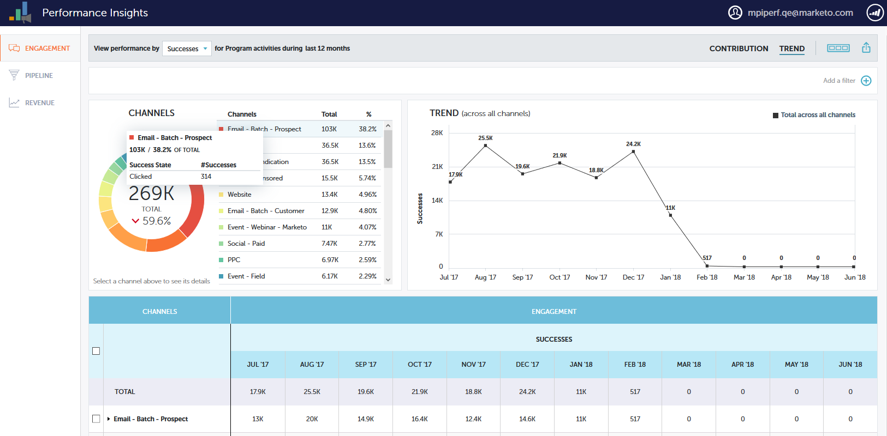

# Información general sobre perspectivas de rendimiento {#performance-insights-overview}

Perspectivas de rendimiento de Marketo le ayuda a optimizar su mezcla de canales para lograr la máxima eficacia, así como a descubrir tendencias a largo plazo para identificar estrategias ganadoras coherentes.

Perspectivas de rendimiento carga datos desde (hasta) los 24 meses anteriores. Esto incluye los datos del año actual y los del año anterior. Por ejemplo, el 31 de enero de 2019 , MPI cargará datos de ese mes y cada mes a partir de 2018. El 31 de diciembre de 2019, MPI cargará datos de cada mes de 2019 y 2018.

Para acceder a Perspectivas de rendimiento, haga clic en su icono en la pantalla de inicio de Analytics.

## Contribución {#contribution}

Evaluar Marketing [contribución a los ingresos](/help/marketo/product-docs/reporting/performance-insights/performance-insights-contribution-overview.md) como función de adquisición de clientes, influencia, conversión e incluso crecimiento base instalado.

De forma predeterminada, los datos mostrados reflejan el rendimiento de Participación. Puede cambiar al rendimiento por Canalización o Ingresos simplemente haciendo clic en uno de ellos.

## Tendencia {#trend}

Descubrir [tendencias a largo plazo](/help/marketo/product-docs/reporting/performance-insights/performance-insights-trend-overview.md) para identificar estrategias ganadoras consistentes.

## Configuración {#settings}

En los paneles Ingresos y Canalización, haga clic en el botón [Configuración](/help/marketo/product-docs/reporting/performance-insights/performance-insights-settings.md) para definir parámetros adicionales.

## Exportar datos {#export-data}

Puede exportar los datos y gráficos en PowerPoint o Excel. También puede guardarlos como un [Gráfico rápido](/help/marketo/product-docs/reporting/performance-insights/performance-insights-quick-charts.md).

>[!NOTE]
>
>Exportar datos a Excel para ver los datos disponibles de todos los canales (no solo de los diez principales). La exportación de PPT será WYSIWYG (la salida imitará lo que ve en la pantalla).
