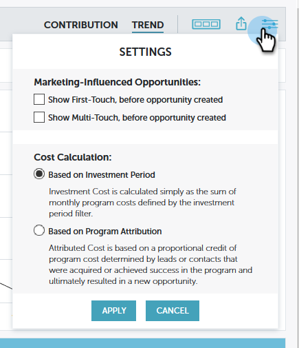

# Información general sobre [!UICONTROL Perspectivas de rendimiento] {#performance-insights-overview}

Las [!UICONTROL perspectivas de rendimiento] de Marketo le ayudan a optimizar la combinación de canales para lograr la máxima eficacia, así como a descubrir tendencias a largo plazo para detectar estrategias ganadoras coherentes.

>[!AVAILABILITY]
>
>No todos han comprado esta función. Póngase en contacto con el equipo de cuenta de Adobe (su administrador de cuentas) para obtener más información.

[!UICONTROL Perspectivas de rendimiento] carga datos de (hasta) los 24 meses anteriores. Esto incluye los datos del año actual hasta la fecha, así como los del año anterior. Por ejemplo, el 31 de enero de 2019 , MPI cargará datos de ese mes y todos los meses a partir de 2018. El 31 de diciembre de 2019, MPI cargará datos de todos los meses de 2019 y 2018.

Para obtener acceso a [!UICONTROL Performance Insights], haga clic en su icono en la pantalla de inicio de Analytics.

## Contribución {#contribution}

Evalúe la [contribución de marketing a los ingresos](/help/marketo/product-docs/reporting/performance-insights/performance-insights-contribution-overview.md) como una función de la adquisición de clientes, la influencia, la conversión e incluso el crecimiento de la base instalada.

De manera predeterminada, los datos mostrados reflejan el rendimiento de [!UICONTROL Engagement]. Puede cambiar al rendimiento por **[!UICONTROL Canalización]** o **[!UICONTROL Ingresos]** simplemente haciendo clic en uno de ellos.

## Tendencia {#trend}

Descubre [tendencias a largo plazo](/help/marketo/product-docs/reporting/performance-insights/performance-insights-trend-overview.md) para detectar estrategias ganadoras consistentes.

## Configuración {#settings}

En los paneles de [!UICONTROL Ingresos] y [!UICONTROL Canalización], haga clic en el icono [[!UICONTROL Configuración]](/help/marketo/product-docs/reporting/performance-insights/performance-insights-settings.md) para establecer parámetros adicionales.

## Exportar datos {#export-data}

Puede exportar los datos y gráficos en [!DNL PowerPoint] o [!DNL Excel]. También puede guardarlos como [Gráfico rápido](/help/marketo/product-docs/reporting/performance-insights/performance-insights-quick-charts.md).

>[!NOTE]
>
>Exporte datos a [!DNL Excel] para ver los datos disponibles de todos los canales (no solo de los diez principales). La exportación de PPT será WYSIWYG (la salida imitará lo que se ve en la pantalla).
