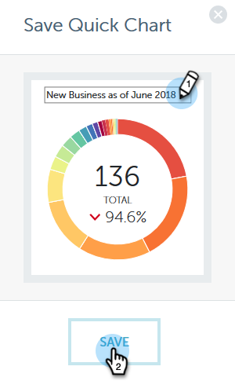

# Gráficos rápidos de Performance Insights {#performance-insights-quick-charts}

Los gráficos rápidos son miniaturas que puede personalizar y guardar, lo que proporciona una vista rápida de los gráficos que más utiliza.

## Crear un nuevo gráfico rápido {#create-a-new-quick-chart}

Los gráficos rápidos se derivan de los datos especificados. En este ejemplo, elegiremos: **nuevas oportunidades (primer contacto), tipo de oportunidad = nuevo negocio, acumulado anual actual**.

1. Haga clic en el filtro de fecha y elija **Año actual (SAA)**.

   

1. Haga clic en **+** y seleccione los criterios.

   

1. El gráfico se actualiza para reflejar los filtros que ha elegido.

   

1. Haga clic en el icono Exportar y seleccione **Guardar como gráfico rápido**.

   

1. Asigne un nombre al gráfico rápido y haga clic en **Guardar**.

   

El gráfico rápido ahora está con los demás.

>[!NOTE]
>
>Puede tener hasta 20 Gráficos rápidos. Se pueden eliminar y reemplazar.

## Ver gráficos rápidos existentes {#view-existing-quick-charts}

1. Para ver los gráficos rápidos existentes, simplemente haga clic en el icono **gráficos rápidos**.

   

## Eliminar un gráfico rápido {#delete-a-quick-chart}

Si necesita eliminar un gráfico rápido, siga estos sencillos pasos.

1. Haga clic en el icono **Gráficos rápidos**.

   

1. Pase el ratón sobre el gráfico que quiera, pero no haga clic en él. Al pasar el ratón por encima, aparecerá una X. Haga clic en **X**.

   

1. Haga clic en **Eliminar**.

   
