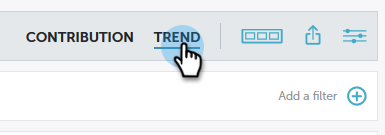

# Información general de tendencias de perspectivas de rendimiento {#performance-insights-trend-overview}

La tendencia muestra el rendimiento de los canales durante un período de tiempo.

Haga clic en la ficha **Tendencia** para acceder a esta vista.

## Tendencia {#trend}

Seleccione la métrica por la que desee realizar la vista del rendimiento. En este ejemplo veremos las oportunidades ganadas a través de [Primer toque](/help/marketo/product-docs/reporting/revenue-cycle-analytics/revenue-tools/attribution/understanding-attribution.md).

Las métricas se presentan mediante dos gráficos: anacardos y líneas.

El gráfico de anillos muestra los diez canales principales de la métrica seleccionada.

El gráfico de líneas muestra la tendencia del rendimiento del canal de la métrica seleccionada en los últimos 12 meses.

Seleccione uno o varios canales y el gráfico de líneas muestra la tendencia del canal. Vuelva a hacer clic en los canales para anular la selección.

La cuadrícula de datos siguiente funciona como una hoja de cálculo, que muestra todos los datos de tendencia disponibles para la métrica seleccionada en los últimos 12 meses.

Expanda un canal para ver sus diez programas principales, con los programas restantes combinados.

>[!NOTE]
>
>Al hacer clic en la casilla de verificación situada junto a un canal, se activa o desactiva en el gráfico de anillos.
