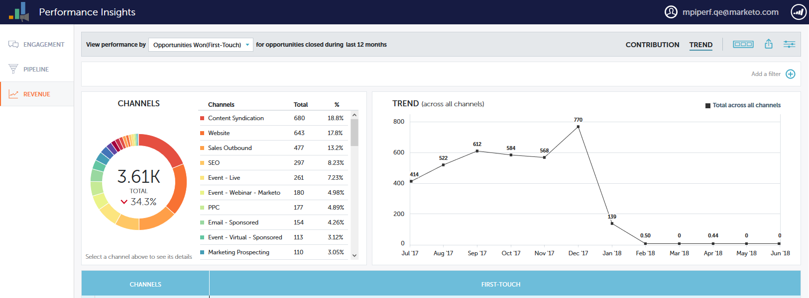

# Información general sobre tendencias de Performance Insights {#performance-insights-trend-overview}

La tendencia muestra el rendimiento del canal de a lo largo de un periodo de tiempo.

Haga clic en **Tendencia** para acceder a esta vista.

## Tendencia {#trend}

Seleccione la métrica por la que desea ver el rendimiento. En este ejemplo analizaremos las oportunidades ganadas a través de [Primer contacto](/help/marketo/product-docs/reporting/revenue-cycle-analytics/revenue-tools/attribution/understanding-attribution.md).

Las métricas se presentan mediante dos gráficos: anillo y línea.

El gráfico de anillos muestra los diez canales principales para la métrica que ha seleccionado.

El gráfico de líneas muestra la tendencia de rendimiento del canal para la métrica seleccionada en los últimos 12 meses.

Seleccione uno o varios canales y el gráfico de líneas mostrará la tendencia del canal. Vuelva a hacer clic en los canales para anular la selección.

La cuadrícula de datos siguiente funciona como una hoja de cálculo y muestra todos los datos de tendencias disponibles para la métrica seleccionada durante los últimos 12 meses.

Expanda un canal para ver sus diez programas principales, con los programas restantes combinados.

>[!NOTE]
>
>Al hacer clic en la casilla de verificación situada junto a un canal, se activa o desactiva en el gráfico de anillos.
