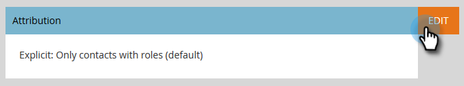
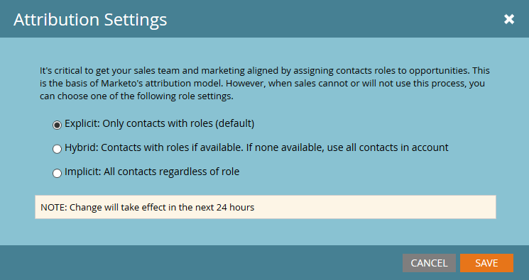

# Configurando [!UICONTROL Perspectivas de rendimiento] {#setting-up-performance-insights}

Siga los pasos a continuación para configurar MPI.

## Configuración de oportunidad {#opportunity-setup}

1. Haga clic en **[!UICONTROL Administrador]**.

   

1. Haga clic en **[!UICONTROL Análisis del ciclo de ingresos]**.

   

   >[!NOTE]
   >
   >Si no tiene RCA, tendrá que seleccionar **[!UICONTROL Análisis de programa]** para el paso 2.

1. En Atribución, haga clic en **[!UICONTROL Editar]**.

   

1. Se muestra Configuración de atribución.

   

   Si la Atribución es explícita, asegúrese de que la Función de contacto de oportunidad se haya rellenado (a través del punto de conexión de la Función de oportunidad o a través de la integración de CRM).

   Si la Atribución está implícita, asegúrese de que el campo de empresa del posible cliente/contacto sea el mismo que el Nombre de cuenta de la oportunidad.

   >[!NOTE]
   >
   >Asegúrese de que todas las oportunidades tengan los campos adecuados rellenados:
   >
   >* [!UICONTROL Importe de oportunidad]
   >* [!UICONTROL Está Cerrado]
   >* [!UICONTROL Ha Ganado]
   >* [!UICONTROL Fecha de creación] (no se puede establecer en su caso)
   >* [!UICONTROL Fecha de cierre] (puede que no se haya establecido en su caso)
   >* [!UICONTROL Tipo de oportunidad]

## Configuración del programa {#program-setup}

Actualice los costes del programa durante al menos 12 meses. Puede hacerlo manualmente o mediante la API del programa. En este ejemplo lo hacemos manualmente.

1. Haga clic en **[!UICONTROL Actividades de marketing]**.

   

1. Busque y seleccione su programa.

   

1. Haga clic en la ficha **[!UICONTROL Configuración]**.

   

1. Arrastre **[!UICONTROL Costo de período]** al lienzo.

   

1. Establezca el mes del programa como mínimo hace 12 meses y haga clic en **[!UICONTROL Aceptar]**.

   

1. Establezca el costo del período y haga clic en **[!UICONTROL Guardar]**.

   

A continuación, revise el comportamiento de Analytics para indicar si algún canal en particular debe incluirse en Analytics. Establezca el Comportamiento de Analytics (Normal, Inclusivo, Operativo).

1. Haga clic en **[!UICONTROL Administrador]**.

   

1. Haga clic en **[!UICONTROL Etiquetas]**.

   

1. Haga clic en **+** para expandir la lista de canales.

   

1. Haga doble clic en el canal deseado.

   

1. Haga clic en el menú desplegable **[!UICONTROL Comportamiento de Analytics]** y seleccione el comportamiento que desee.

   

1. Defina los criterios de éxito.

   

1. Haga clic en **[!UICONTROL Guardar]**.

   

## Vinculación del programa a la persona {#tie-the-program-to-the-person}

1. Asegúrese de que el programa de adquisición y la fecha de adquisición se hayan establecido para cada persona de la base de datos para que funcione la Atribución de primer contacto.
1. Asegúrese de que los programas establezcan estados de éxito para sus recursos.

>[!NOTE]
>
>Los cambios realizados no son instantáneos. Se requiere un período de un día para que los cambios entren en vigor.
