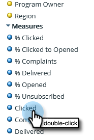

# Creación de un informe de análisis de correo electrónico que enumere los posibles clientes {#build-an-email-analysis-report-that-lists-leads}

Siga estos pasos para crear un informe de análisis de correo electrónico que le muestre todos los posibles clientes a los que se ha enviado un correo electrónico específico. Este informe también incluirá las estadísticas de clics y aperturas.

>[!AVAILABILITY]
>
>No todos los clientes han adquirido esta funcionalidad. Póngase en contacto con el administrador de éxito del cliente para obtener más información.

>[!NOTE]
>
>El motor de datos que respalda el análisis de correo electrónico RCA ignora los buenos 12 clics por persona si proceden del mismo correo electrónico y campaña. Tenga esto en cuenta al comparar los informes de análisis de correo electrónico con los informes estándar de Marketo Analytics.

1. Launch **Explorador de ingresos**.

   

1. Haga clic en **Crear nuevo** then **Informe**.

   

1. Seleccione Análisis de correo electrónico y haga clic en **OK**.

   

1. Busque el punto amarillo Nombre del correo electrónico, haga clic con el botón derecho en él y seleccione **Filtro**.

   

1. Haga doble clic en el correo electrónico de su elección en la lista y haga clic en **OK**.

   

1. Arrastre el **Nombre del correo electrónico** punto amarillo a **Columnas**.

   

   >[!TIP]
   >
   >Hay muchos atributos de cliente o empresa que puede agregar como columnas, ¡desprotéjelas!

1. Busque la **Nombre completo** punto amarillo y arrástrelo a **Filas**.

   

1. Ahora, agregue la variable **Medidas** le interesa hacer doble clic en ellos.

   

>[!NOTE]
>
>En función de la cantidad de datos que tenga, este informe podría tardar un rato en actualizarse.

¡Misión completa!
