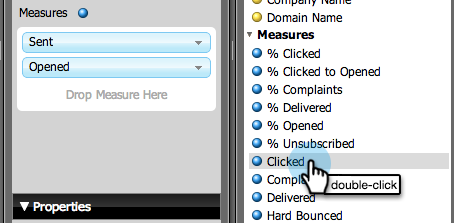

# Genere un informe de Análisis de correo electrónico que Lista los posibles clientes {#build-an-email-analysis-report-that-lists-leads}

>[!AVAILABILITY]
>
>No todos los clientes han adquirido esta funcionalidad. Póngase en contacto con su representante de ventas para obtener más detalles.

Siga estos pasos para crear un informe de Análisis por correo electrónico que muestre todos los posibles clientes que se enviaron por correo electrónico en particular. Este informe también incluirá las estadísticas de clic y apertura. 1. Inicie el Explorador de ingresos.

1. Haga clic en **Nuevo informe**.

   

1. Seleccione el área de Análisis de correo electrónico y haga clic en **Aceptar**.

   

1. Busque el punto amarillo Nombre del correo electrónico, haga clic con el botón derecho y seleccione **Filtro**.

   

1. Haga clic con el doble en el correo electrónico de su elección en la lista y haga clic en **Aceptar**.

   

1. Arrastre el punto amarillo Nombre del correo electrónico a Columnas.

   

   >[!TIP]
   >
   >Hay muchos atributos de posibles clientes y compañías que puede agregar como columnas, ¡desprotéjelas!

1. Busque el punto amarillo Nombre completo y arrástrelo a Filas.

   

1. Ahora agregue las medidas que le interesen haciendo clic en ellas con el doble.

   

>[!NOTE]
>
>Según la cantidad de datos que tenga este informe, puede que tarde un tiempo en actualizarse.

Ahora que ya ha terminado, el informe debe tener este aspecto:

¡Misión completada!
