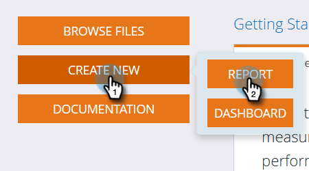

# Generar un informe de análisis de correo electrónico que enumere los posibles clientes {#build-an-email-analysis-report-that-lists-leads}

>[!AVAILABILITY]
>
>No todos los clientes han adquirido esta funcionalidad. Póngase en contacto con su representante de ventas para obtener más información.

Siga estos pasos para crear un informe de análisis de correo electrónico que le muestre todos los posibles clientes a los que se ha enviado un correo electrónico específico. Este informe también incluirá las estadísticas de clics y aperturas.

1. Inicie **Ingresos Explorer**.

   

1. Haga clic en **Crear nuevo** y luego en **Informe**.

   

1. Seleccione Análisis de correo electrónico y haga clic en **OK**.

   

1. Busque el punto amarillo Nombre del correo electrónico, haga clic con el botón derecho en él y seleccione **Filtro**.

   

1. Haga doble clic en el correo electrónico de su elección en la lista y haga clic en **OK**.

   

1. Arrastre el punto amarillo **Email Name** a **Columns**.

   

   >[!TIP]
   >
   >Hay muchos atributos de cliente o empresa que puede agregar como columnas, ¡desprotéjelas!

1. Busque el punto amarillo **Full Name** y arrástrelo a **Rows**.

   

1. Ahora agregue las **Medidas** que le interesen haciendo doble clic en ellas.

   

>[!NOTE]
>
>En función de la cantidad de datos que tenga, este informe podría tardar un rato en actualizarse.

¡Misión completa!
