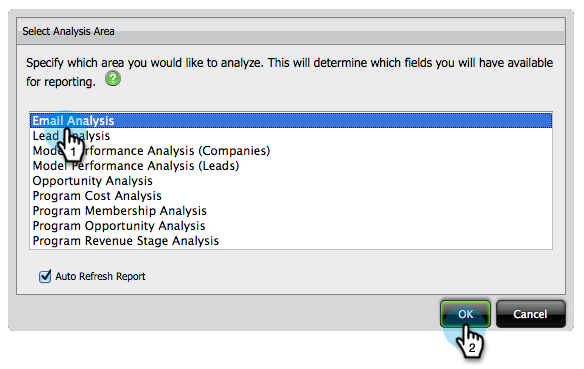

# Crear un informe de análisis de correo electrónico que muestre información del programa {#build-an-email-analysis-report-that-shows-program-information}

Siga estos pasos para crear un informe de análisis de correo electrónico que muestre la información de correo electrónico agrupada por canales de programa.

>[!AVAILABILITY]
>
>No todos han comprado esta función. Póngase en contacto con el equipo de cuenta de Adobe (su administrador de cuentas) para obtener más información.

1. Iniciar **[!UICONTROL Explorador de ingresos]**.

   

1. Haga clic en **[!UICONTROL Crear nuevo]** y seleccione **[!UICONTROL Informe]**.

   

1. Seleccione el área **[!UICONTROL Análisis de correo electrónico]** y haga clic en **[!UICONTROL Aceptar]**.

   

1. Busque el punto amarillo **[!UICONTROL Enviado (semana)]** y haga clic con el botón secundario en él. Haga clic en **[!UICONTROL Filtro...]**.

   >[!NOTE]
   >
   >Esto reducirá el periodo de tiempo del informe.

   

1. Marque **[!UICONTROL Enviado actual (semana)]** y haga clic en **[!UICONTROL Aceptar]**.

   

1. Busque y haga doble clic en el punto amarillo **[!UICONTROL Canal del programa]**.

   

1. Busque y haga doble clic en el punto amarillo **[!UICONTROL Nombre de correo electrónico]**.

   

1. Busque y haga doble clic en los puntos azules **[!UICONTROL Enviados]**, **[!UICONTROL Abiertos]** y **[!UICONTROL Hechos clic]**.

   

   ¡Buen trabajo! Debe tener un informe con un aspecto similar al siguiente:

   
