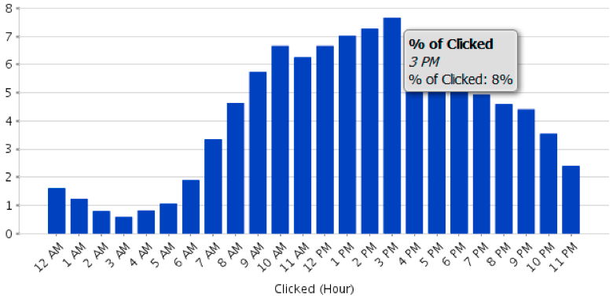

# Explicación del área de Análisis de correo electrónico {#understanding-the-email-analysis-area}

El área de Análisis de correo electrónico se centra en las métricas de correo electrónico. Este artículo presenta todos los informes disponibles dentro de él.

>[!NOTE]
>
>**Disponibilidad**
>
>Esto está disponible para los usuarios con el complemento Select Edition o [Revenue Cycle Analytics](http://www.marketo.com/global-enterprise/marketo-revenue-cycle-analytics/) . Póngase en contacto con su representante de ventas para obtener más detalles.

## Cuadrícula de calor de Actividad de clic de correo electrónico {#email-click-activity-heat-grid}

Este informe muestra el día de la semana y la hora del día en que los posibles clientes hacen clic en los correos electrónicos. Cuanto más verde sea el cuadro, más clics habrá en ese día y hora específicos. El filtro actual incluye todos los correos electrónicos enviados en los últimos 7 días. El tiempo está en CCT.

## Distribución de tiempo de clic en correo electrónico {#email-clicked-time-distribution}

Este informe muestra el porcentaje del total de clics por correo electrónico para cada hora del día. El filtro actual incluye todos los correos electrónicos enviados en los últimos 7 días. El tiempo está en CCT.

## Descenso de la tasa de clics por correo electrónico {#email-click-rate-decay}

Este informe muestra el porcentaje total de clics por correo electrónico que se produjeron el mismo día en que se envía un mensaje de correo electrónico y los días posteriores. El filtro actual incluye todos los correos electrónicos enviados hace 7 días.

## Enviar por correo electrónico la cuadrícula de calor de la Actividad abierta {#email-open-activity-heat-grid}

Este informe muestra el día de la semana y la hora del día en que los posibles clientes abren correos electrónicos. Cuanto más verde sea el cuadro, más se abrirá en ese día y hora específicos. El filtro actual incluye todos los correos electrónicos enviados en los últimos 7 días. El tiempo está en CCT.

## Descomposición de velocidad de apertura {#open-rate-decay}

Este informe muestra el porcentaje total de aperturas de correo electrónico que se produjeron el mismo día en que se envía un correo electrónico y los días posteriores. El filtro actual incluye todos los correos electrónicos enviados hace 7 días.

## Distribución de tiempo abierto {#open-time-distribution}

Este informe muestra el porcentaje total de mensajes de correo electrónico que se abren a cada hora del día. El filtro actual incluye todos los correos electrónicos enviados en los últimos 7 días. El tiempo está en CCT.

## Cuadrícula de calor de Actividad enviada {#sent-activity-heat-grid}

Este informe muestra el día de la semana y la hora del día en que envía los mensajes de correo electrónico. Cuanto más verde sea el cuadro, más correos electrónicos se enviarán en ese día y hora específicos. El filtro actual incluye todos los correos electrónicos enviados en los últimos 7 días. El tiempo está en CCT.

