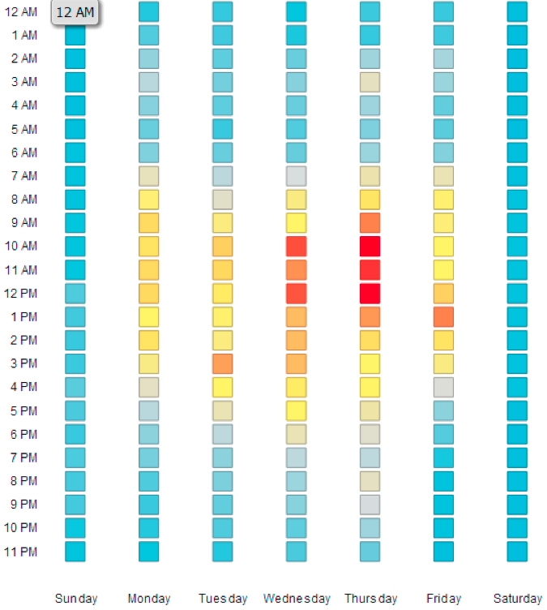

# Explicación del área de análisis de correo electrónico {#understanding-the-email-analysis-area}

El área de análisis de correo electrónico se centra en las métricas de correo electrónico. Este artículo presenta todos los informes disponibles en él.

>[!AVAILABILITY]
>
>Está disponible para los usuarios con el complemento Select Edition o [Revenue Cycle Analytics](https://www.marketo.com/global-enterprise/marketo-revenue-cycle-analytics/). Póngase en contacto con su representante de ventas para obtener más información.

## Cuadrícula de calor de actividad de clic de correo electrónico {#email-click-activity-heat-grid}

Este informe muestra en qué día de la semana y a qué hora del día hacen clic los posibles clientes en los correos electrónicos. Cuanto más verde sea el cuadro, más clics se producirán en ese día y hora específicos. El filtro actual incluye todos los correos electrónicos enviados en los últimos 7 días. El tiempo es en CST.

## Distribución del tiempo de clic en correo electrónico {#email-clicked-time-distribution}

Este informe muestra el porcentaje del total de clics en correos electrónicos para cada hora del día. El filtro actual incluye todos los correos electrónicos enviados en los últimos 7 días. El tiempo es en CST.

## Deterioro de tasa de clics en correo electrónico {#email-click-rate-decay}

Este informe muestra qué porcentaje del total de clics de correos electrónicos se produjeron el mismo día en que se envió un correo electrónico y en los días siguientes. El filtro actual incluye todos los correos electrónicos enviados hace 7 días.

## Cuadrícula de calor de actividad abierta de correo electrónico {#email-open-activity-heat-grid}

Este informe muestra qué día de la semana y hora del día abren los posibles clientes. Cuanto más verde sea el cuadro, más se abrirá en ese día y hora específicos. El filtro actual incluye todos los correos electrónicos enviados en los últimos 7 días. El tiempo es en CST.

## Descenso de velocidad de apertura {#open-rate-decay}

Este informe muestra qué porcentaje del total de aperturas de correo electrónico se produjeron el mismo día en que se envió un correo electrónico y en los días siguientes. El filtro actual incluye todos los correos electrónicos enviados hace 7 días.

## Distribución del tiempo de apertura {#open-time-distribution}

Este informe muestra el porcentaje del total de correos electrónicos abiertos a cada hora del día. El filtro actual incluye todos los correos electrónicos enviados en los últimos 7 días. El tiempo es en CST.

## Cuadrícula de calor de actividad enviada {#sent-activity-heat-grid}

Este informe muestra qué día de la semana y a qué hora del día está enviando los correos electrónicos. Cuanto más verde sea la casilla, más correos electrónicos se enviarán en ese día y hora específicos. El filtro actual incluye todos los correos electrónicos enviados en los últimos 7 días. El tiempo es en CST.

