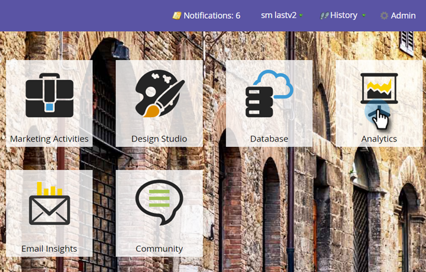
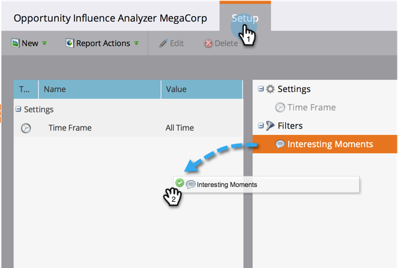

# Configurar un analizador de influencia de la oportunidad {#configure-an-opportunity-influence-analyzer}

Una vez que [haya creado un Analizador de influencia de oportunidad](/help/marketo/product-docs/reporting/revenue-cycle-analytics/opportunity-influence-analyzer/create-an-opportunity-influence-analyzer.md), podrá configurar los tipos de [momentos interesantes](/help/marketo/product-docs/marketo-sales-insight/msi-for-salesforce/features/tabs-in-the-msi-panel/interesting-moments/interesting-moments-overview.md) que se incluyen.

>[!PREREQUISITES]
>
>[Crear un Analizador de influencia de oportunidad](/help/marketo/product-docs/reporting/revenue-cycle-analytics/opportunity-influence-analyzer/create-an-opportunity-influence-analyzer.md)

1. Haga clic en **[!UICONTROL Analytics]**.

   

1. Vaya a **[!UICONTROL Analytics]** y seleccione su Analizador de influencia de oportunidades.

   

   Si hay demasiados momentos interesantes en el gráfico del analizador, puede reducirlos si anula la selección de personas en el panel **[!UICONTROL Configuración]** o si reduce los tipos de momentos interesantes.

1. Para configurar qué tipos de momentos interesantes se deben incluir, ve a la pestaña **[!UICONTROL Configuración]** y arrastra el filtro **[!UICONTROL Momentos interesantes]**.

   

1. Elija si desea mostrar **[!UICONTROL Todos]**, **[!UICONTROL Ninguno]** o **[!UICONTROL Algunos]**.

   

1. Si elige **[!UICONTROL Algunos]**, puede elegir los tipos que desea incluir.

   

1. Haga clic en cada tipo de momento interesante que desee. Luego haz clic en **[!UICONTROL Guardar]**.

1. Haga clic en la pestaña principal para ver el historial de la oportunidad con solo los tipos seleccionados de momento interesante.

   

>[!MORELIKETHIS]
>
>[Contar la historia de mercadotecnia con un Analizador de influencia de oportunidades](/help/marketo/product-docs/reporting/revenue-cycle-analytics/opportunity-influence-analyzer/tell-the-marketing-story-with-an-opportunity-influence-analyzer.md)
