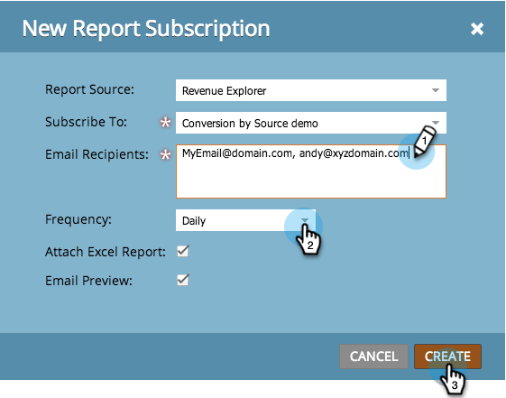
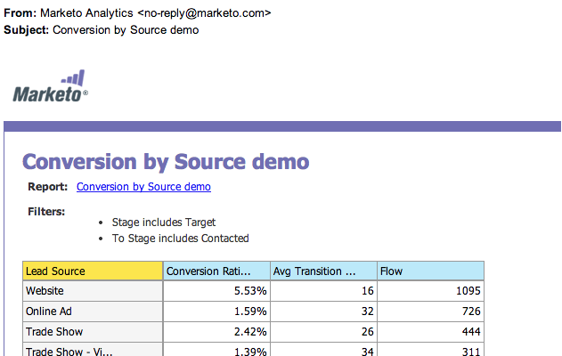

# Exportar datos del analizador de influencia de la oportunidad {#export-opportunity-influence-analyzer-data}

Para recibir actualizaciones de sus informes del Explorador de ciclos de ingresos y compartirlos, puede suscribir cualquier dirección de correo electrónico a un informe existente.

1. Vaya a **[!UICONTROL Analytics]** y seleccione **[!UICONTROL Nuevo]** > **[!UICONTROL Nueva suscripción a informe]**.

   

   >[!NOTE]
   >
   >Para suscribirse a un informe básico que creó en un programa, vea [Suscribirse a un informe básico](/help/marketo/product-docs/reporting/basic-reporting/report-subscriptions/subscribe-to-a-basic-report.md).

1. Para **[!UICONTROL Report Source]**, seleccione **[!UICONTROL Explorador de ingresos]**.

   

1. Navegue por el árbol de carpetas y seleccione el informe.

   

1. Introduzca las direcciones de correo electrónico y defina la frecuencia de los correos electrónicos de los informes.

   

   >[!NOTE]
   >
   >Cualquiera puede cancelar la suscripción al informe en el correo electrónico que reciba.

1. ¡Su suscripción está establecida! Si ha incluido su propia dirección de correo electrónico, recibirá el informe por correo electrónico.

   

>[!MORELIKETHIS]
>
>Aprenda a [administrar todas las suscripciones a informes](/help/marketo/product-docs/reporting/basic-reporting/report-subscriptions/manage-report-subscriptions.md) en un solo lugar.
