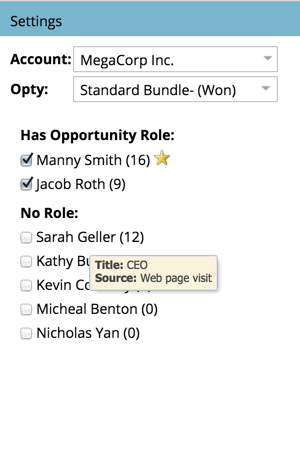

# Informe a Marketing Story con un analizador de influencia de oportunidades {#tell-the-marketing-story-with-an-opportunity-influence-analyzer}

Utilice un Analizador de influencia de oportunidades para ilustrar el papel de la mercadotecnia en oportunidades importantes. Muestra cómo el marketing influyó en una oportunidad, desde el primer toque hasta la creación de oportunidades y la victoria, y más allá.

>[!PREREQUISITES]
>
>[Crear un analizador de influencia de oportunidades](/help/marketo/product-docs/reporting/revenue-cycle-analytics/opportunity-influence-analyzer/create-an-opportunity-influence-analyzer.md)

1. Vaya a **Analytics** y seleccione el **Analizador de influencia de oportunidad**.

   

   El Analizador de influencia de oportunidades es una representación visual de las interacciones y los éxitos de programas y eventos que implican esa oportunidad. Veamos el gráfico:

   *  **Los** puntos naranja representan momentos  [interesantes ](/help/marketo/product-docs/marketo-sales-connect/marketo/interesting-moments-in-msc.md) en la oportunidad (correos electrónicos abiertos, visitas a las cabinas comerciales, descargas de documentos técnicos, etc.). Los puntos más grandes indican más interacciones.

   *  **los iconos de enlace** indican los éxitos del programa.

   *  **los iconos de calendario** indican los éxitos de evento.

   * **Período** de oportunidad. El área verde representa la oportunidad misma, desde la creación de oportunidades hasta el cierre de oportunidades (ganado o perdido).

   * **Ciclo** de vida de oportunidad. Las áreas grises antes y después del período de oportunidad verde muestran las interacciones que condujeron y siguieron a la oportunidad.

   El panel **Configuración** lista a las personas de la cuenta:

   * El **número entre paréntesis** es el número de interacciones con ese contacto.

   * el  **amarillo** estelar indica el contacto principal.

1. Pase el ratón sobre un nombre para ver el puesto de esa persona y la fuente de su participación en la oportunidad.

   

1. Seleccione la casilla de verificación para incluir las interacciones de esa persona en el gráfico.

   

   El gráfico se ajusta automáticamente para mostrar sus interacciones en la oportunidad. En este ejemplo, vemos inmediatamente que la CEO de MegaCorp Sarah Geller estuvo profundamente involucrada en la oportunidad, aunque no tenía un rol asignado en el CRM para la oportunidad.

1. Haga clic en un punto naranja para ver los detalles de la interacción.

   

   En nuestro ejemplo, nos enteramos que la CEO Sarah Geller visitó el sitio web varias veces e incluso se suscribió al blog. Esto sugiere que el interés de MegaCorp en la oportunidad fue impulsado, en gran parte, por programas y activos de Marketing.

   Haga clic en más puntos anaranjados a lo largo de la cronología para completar la historia de los eventos, programas y momentos interesantes que ayudaron a crear y cerrar la oportunidad.

   >[!MORELIKETHIS]
   >
   >[Configurar un analizador de influencia de oportunidades](/help/marketo/product-docs/reporting/revenue-cycle-analytics/opportunity-influence-analyzer/configure-an-opportunity-influence-analyzer.md)
