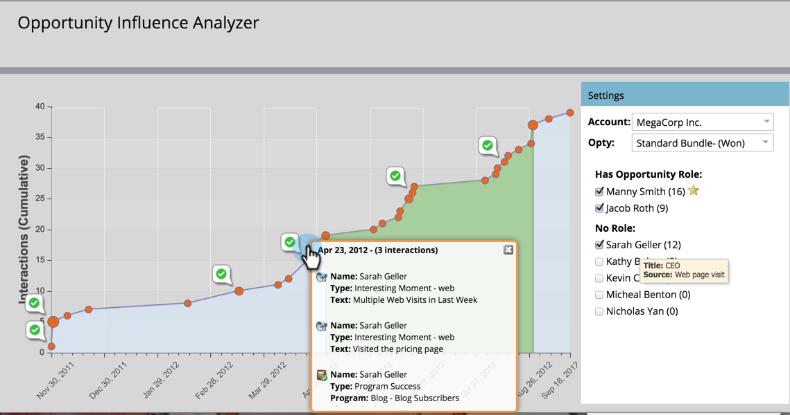

# Contar la historia de marketing con un analizador de influencia de oportunidades {#tell-the-marketing-story-with-an-opportunity-influence-analyzer}

Utilice un Analizador de influencia de oportunidades para ilustrar el papel del marketing en las oportunidades importantes. Muestre cómo el marketing influyó en una oportunidad, desde el primer contacto hasta la creación y la victoria de oportunidades, y más allá.

>[!PREREQUISITES]
>
>[Crear un analizador de influencia de oportunidades](/help/marketo/product-docs/reporting/revenue-cycle-analytics/opportunity-influence-analyzer/create-an-opportunity-influence-analyzer.md)

1. Ir a **Analytics** y seleccione la **Analizador de influencia de oportunidad**.

   

   El Analizador de influencia de oportunidades es una representación visual de las interacciones y los éxitos de programas y eventos que intervienen en esa oportunidad. Vamos a explorar el gráfico:

   *  **Puntos naranjas** representar momentos interesantes en la oportunidad (correos electrónicos abiertos, visitas a stands de ferias comerciales, descargas de documentos técnicos, etc.). Los puntos más grandes indican más interacciones.

   *  **Iconos del cuaderno** indicar los éxitos del programa.

   *  **Iconos del calendario** indicar los éxitos del evento.

   * **Período de oportunidad**. El área verde representa la oportunidad en sí misma, desde la creación de oportunidades hasta el cierre de oportunidades (ganadas o perdidas).

   * **Ciclo de vida de oportunidad**. Las áreas grises antes y después del período de oportunidad verde muestran las interacciones que llevaron a la oportunidad y la siguieron.

   El **Configuración** el panel enumera las personas de la cuenta:

   * El **número entre paréntesis** es el número de interacciones con ese contacto.

   * El **estrella amarilla** indica el contacto principal.

1. Pase el ratón por encima de un nombre para ver el puesto que ocupa esa persona y la fuente de su participación en la oportunidad.

   

1. Seleccione la casilla de verificación para incluir las interacciones de esa persona en el gráfico.

   

   El gráfico se ajusta automáticamente para mostrar sus interacciones en la oportunidad. En este ejemplo, vemos inmediatamente que la CEO de MegaCorp, Sarah Geller, estuvo profundamente involucrada en la oportunidad, aunque no tenía un rol asignado en CRM para la oportunidad.

1. Haga clic en un punto naranja para ver los detalles de la interacción.

   

   En nuestro ejemplo, nos enteramos de que la CEO Sarah Geller visitó el sitio web varias veces e incluso se suscribió al blog. Esto sugiere que el interés de MegaCorp en la oportunidad fue impulsado, en gran parte, por los programas y activos de Marketing.

   Haga clic en más puntos naranjas a lo largo de la cronología para completar la historia de los eventos, programas y momentos interesantes que ayudaron a crear y cerrar la oportunidad.

   >[!MORELIKETHIS]
   >
   >[Configuración de un analizador de influencia de oportunidades](/help/marketo/product-docs/reporting/revenue-cycle-analytics/opportunity-influence-analyzer/configure-an-opportunity-influence-analyzer.md)
