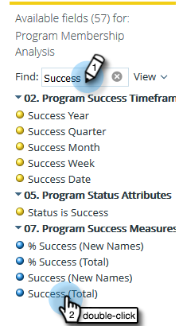

# Genere un informe de Análisis de membresía de Programa que Lista los posibles clientes {#build-a-program-membership-analysis-report-that-lists-leads}

Siga estos pasos para crear un informe de Análisis de pertenencia a Programa que muestre todos los nombres de miembros de programa.

>[!AVAILABILITY]
>
>No todos los clientes han adquirido esta funcionalidad. Póngase en contacto con su representante de ventas para obtener más detalles.

1. Inicie el Explorador de ingresos.

   

1. Haga clic en **Crear nuevo** y luego **Informe**.

   

1. Seleccione **Análisis de pertenencia a Programa** y haga clic en **Aceptar**.

   

1. Busque y haga clic con el botón doble en el punto amarillo Nombre del Programa.

   

1. Busque y haga clic con el botón doble en el punto azul Miembros.

   

1. Busque y haga clic con el botón doble en el punto azul de éxito (total).

   

¿Ves lo fácil que fue eso?

Puede agregar rápidamente un atributo de posible cliente como _Nombre completo_ para ver quiénes son los miembros.

>[!TIP]
>
>Hay muchos atributos de posibles clientes y compañías que elegir. ¡Échenlos!

1. Busque y haga clic con el doble en el punto amarillo **Nombre completo**.

   

¡Ahí lo tienes!

