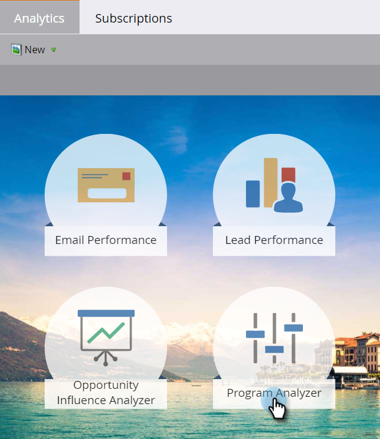

# Clonar un analizador de Programas {#clone-a-program-analyzer}

Después de guardar un analizador, es fácil clonarlo para crear uno nuevo. A continuación, vaya y edite el nuevo si necesita cambios.

1. Haga clic en el icono **Análisis **.

   

1. Haga clic en el mosaico del Analizador de **Programas** .

   

1. Mientras el analizador guardado está abierto, abra la lista desplegable Acciones del analizador y seleccione Analizador **de clonar**.

   

1. Seleccione la ubicación del analizador clonado en las listas desplegables **Clonar para** y **Carpeta** .

   

1. Asigne un nombre al analizador clonado y haga clic en **Clonar**.

   

1. Ahora, tienen dos analizadores idénticos con nombres diferentes. Abra el clon para realizar los cambios necesarios.

   

   >[!NOTE]
   >
   >**Artículos relacionados**
   >
   >    
   >    
   >    * [Creación de un analizador de Programas](create-a-program-analyzer.md)

